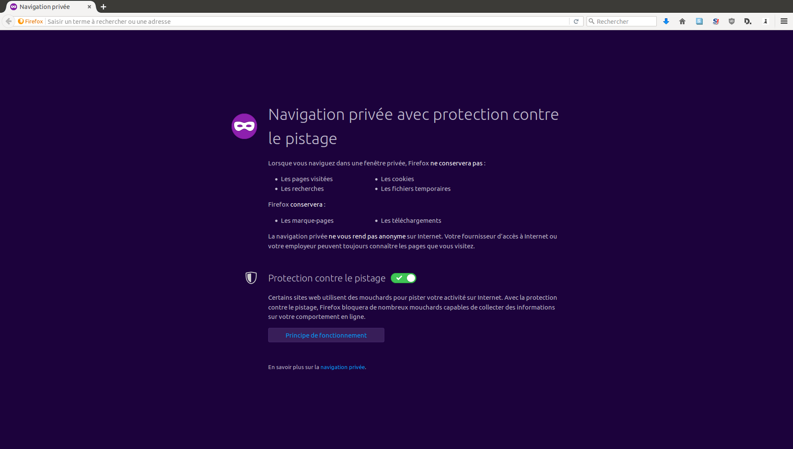
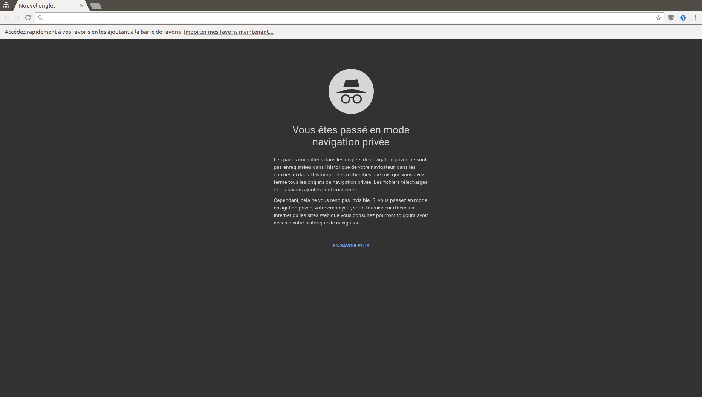
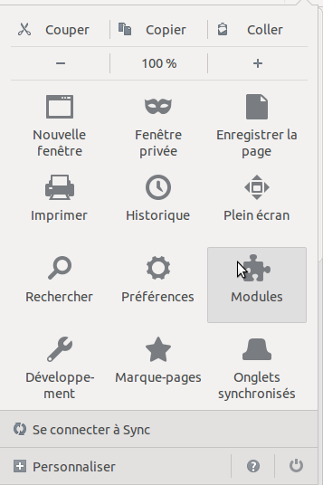
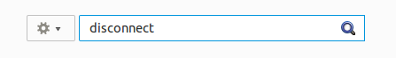
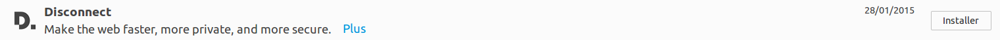
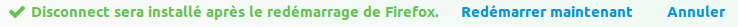

Tracking
========

Lorsque vous naviguez sur le web, vous laissez des petites traces sur votre chemin. Beaucoup de sites web utilisent ces données pour établir des statistiques, compter les visiteurs et connaître les pages les plus populaires mais certains sites utilisent diverses techniques afin de suivre individuellement chaque visiteur. Malheureusement, cela ne s'arrête pas là car certaines entreprises stockent vos données pour vous suivre sur d'autres sites. Ces informations peuvent être compilées et partagées à d'autres organisations sans que vous le sachiez.

Cela peut sembler inquiétant mais peu de gens se posent la question de savoir ce que les sites web ont sur eux ? Les gros sites web compilent et utilisent ces données pour faire de la **publicité comportementale** où les messages publicitaires sont taillés sur mesure pour nous satisfaire. C'est pour cette raison que lorsque vous visitez la page Wikipedia concernant Majorque, des publicités s'affichent alors pour vous proposer des voyages. Cela peut sembler anodin mais lorsque vous effectuez des recherches sur les traitements contre l'herpès ou sur les communautés fétichistes et que vous apercevez des publicités sur ces sujets là, il est probable que vous vous sentiez mal à l'aise et que vous pensiez que le *web* en connaît trop sur vous.

Ces informations intéressent aussi d'autres entités comme votre compagnie d'assurances. Si elle sait que vous avez recherché des sites de parachutisme ou que vous avez visité des forums à propos de malformations congénitales, vos primes augmenteront probablement. Vos employeurs potentiels ou propriétaires pourrait ne pas vous choisir en raison de ce qu'ils ont vu sur le web. Dans le pire des cas, la police ou l'inspection des finances pourraient développer des suspicions à votre propos sans que vous n'ayez commis un crime ou délit mais simplement basées sur une navigation *anormale* sur le web. 

Comment nous suivent-ils ? 
--------------------------

À chaque fois que vous chargez une page web, le serveur enregistre une ligne dans un journal avec différentes informations comme votre adresse IP, l'heure de chargement de la page et son nom. En plus de cela, le serveur peut créer un fichier temporaire permettant de stocker d'autres informations. Cela n'est pas toujours une mauvaise chose car, lorsque vous vous connectez sur un site, le serveur peut garder une trace de vous afin de sauvegarder certaines de vos préférences. Le fichier en question est désigné par le nom **cookie** et est placé sur votre navigateur. Cela peut sembler inoffensif mais le problème est que ces informations restent sur votre ordinateur même après avoir quitté le site qui les a déposé. Quelques sites web importants comme Facebook et Google gardent une trace de votre navigation même après votre déconnexion. 

Comment puis-je éviter d'être suivi ?
-------------------------------------

Le moyen le plus simple pour empêcher le tracking est de supprimer les cookies depuis votre navigateur :

Dans **Firefox** :
 
 1. Ouvrez le **menu de Firefox**.
 2. Cliquez sur **Préferences**.
 3. Cliquez sur **Vie privée**.
 4. Cliquez sur **Afficher les cookies ...**.
 5. Cliquez sur **Tout supprimer**.
 
Dans **Chrome** :

 1. Cliquez sur le **menu de Google Chrome**.
 2. Cliquez sur **Paramètres**.
 3. Cliquez sur **Historique**.
 4. Cliquez sur **Effacer les données de navigation ...**.
 5. Dans la liste déroulante, choisissez **tous**.
 6. Cliquez sur **Effacer les données de navigation**.

La limite de cette approche est qu'elle ne bloque pas les cookies, retournez sur le web et de nouveaux cookies s'enregistreront. L'une des conséquences de cette effacement sera la perte des sessions enregistrés. Vous devrez vous reconnecter à tous vos sites préférés en utilisant vos identifiants. Si vous ne voulez pas que des cookies soient enregistrés durant une session de surf sur le web, la plupart des navigateurs proposent désormais un mode de **navigation privée**. Cela permet d'utiliser votre navigateur de telle façon qu'il n'enregistrera pas de cookies, d'historique ou de liste de fichiers téléchargés. Pour utiliser ce mode :

Dans **Firefox** :
 
 1. Ouvrez le **menu de Firefox**.
 2. Cliquez sur **Fenêtre privée**.
 3. La page suivante vous confirmera que vous utilisez bien la navigation privée. 

 
 

Dans **Chrome**:
 
 1. Ouvrez le **menu de Chrome**.
 2. Cliquez sur **Nouvelle fenêtre de navigation privée**.
 3. La page suivante vous confirmera que vous utilisez bien la navigation privée.
 
 
 

Cette approche possède également des limitations. Nous ne pouvons pas sauvegarder des marque-pages ou nos mots de passe et nous nous privons ainsi de multiples avantages offerts par les navigateurs modernes. Heureusement, il existe de nombreuses extensions spécialement conçues pour lutter contre le tracking et la plus efficace est **Disconnect**. Elle vous permet de bloquer des catégories entières de sites web et services qui suivent les utilisateurs. Ci-dessous, les étapes d'installation de Disconnect : 

Dans **Firefox** :

 1. Ouvrez sur le **menu de Firefox** et cliquez sur **Modules**.
 
 

 2. Dans la barre de recherche, tapez "disconnect" et pressez la touche **Entrer**.

 

 3. Retrouvez Disconnect dans la liste et cliquez sur **Installer**.

 

 4. Redémarrez votre navigateur en cliquant sur **Redémarrer maintenant**.
 
 
 
 5. Visitez un site et cliquez sur l'icône Disconnect pour voir la liste des trackers bloqués.

Il est également conseillé d'installer un bloqueur du publicité comme **uBlock Origin**. Cette extension bloquera automatiquement les cookies déposés par les publicitaires mais pas ceux de Google, Facebook et autres sociétés de d'analyse de trafic. 

Comment voir qui me traque ?
----------------------------

Grâce à l'extension Disconnect, vous pouvez voir le nom des sociétés qui vous suivent sur le web. Cliquez simplement sur l'icône de l'extension, les traqueurs sont classées par catégorie.

Précisions importantes
----------------------

Si vous bloquez les traqueurs, vous aurez une meilleure protection de votre vie privée lorsque vous surferez sur le web. Cependant, les agences de renseignement, votre patron, les pirates et les administrateurs systèmes pourront toujours intercepter votre trafic et suivre ce que vous regardez. Si vous voulez vous protéger contre cela, vous devriez lire le chapitre sur le chiffrement. Votre adresse IP restera visible des autres personnes sur Internet. Si vous voulez vous protéger contre cela, vous devriez lire le chapitre sur les techniques d'anonymisation.
