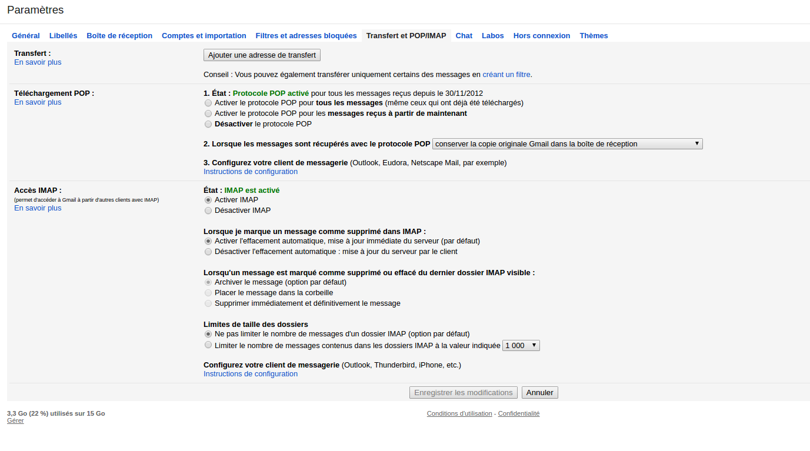
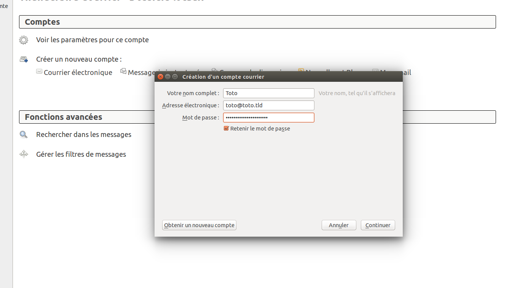
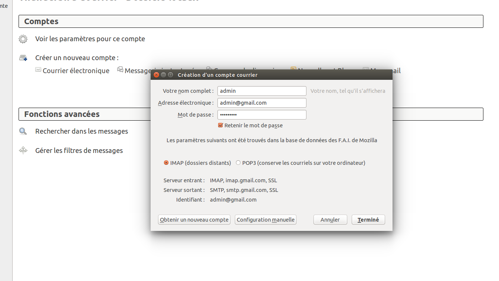

Mettre en place des connexions sécurisés
========================================

Il y a une bonne manière (sécurisé) de configurer votre connexion avec les serveurs de votre fournisseur de service mail et une mauvaise. L'aspect le plus fondamental de la sécurité des emails est le type de connexion que vous utilisez avec les serveurs mails de votre fournisseur de service.

À chaque fois que cela est possible, vous devriez utiliser les protocoles **SSL** (Secure Socket Layer) et **TLS** (Transport Layer Security). (**STARTTLS**, qui est également une option disponible lorsque vous configurez votre compte, est une variation de SSL / TLS). Ces protocoles empêchent l'interception et la récupération de vos mots de passe par votre propre système (derrière Thunderbird) et par tous les points entre votre système et le serveur mail. SSL / TLS empêche également la lecture du contenu des messages sur le réseau.

Toutefois, ces protocoles ne sécurise que la connexion entre votre ordinateur et le serveur mail, ils ne protègent pas le contenu du message. Une fois que le serveur mail a transféré le message, il peut être intercepté et lu par chacun des noeuds sur le trajet vers le destinataire.

C'est là que **PGP** (Pretty Good Privacy) est utile. Son utilisation sera décrite dans le prochain chapitre.

La premère étape consiste à mettre en place une connexion sécurisé entre votre systèe et les serveurs mail. Ce chapitre décrit comment mettre en place votre compte mail de la bonne manière.

Configuration requise
---------------------

Lorsque vous configurez un compte, Thunderbird tente de déterminer les paramètres de connexion à votre fournisseur de service. Bien que Thunderbird connaisse les paramètres de connexion pour de nombreux fournisseurs, il ne les connait pas tous. Si les paramètres ne sont pas connus, vous devrez fournir les informations suivantes pour configurer votre compte :

 * **Votre nom d'utilisateur**
 * **Votre mot de passe**
 * **Serveur entrant :** adresse (sous la forme `imap.example.com`), protocole (POP ou IMAP), port (par défaut, 110) et protocole de sécurité
 * **Serveur sortant :** adresse (sous la forme `smtp.example.com`), port (par défaut, 25) et protocole de sécurité

Votre fournisseur de service a dû vous envoyer ces informations. Vous pouvez aussi les retrouver sur leur site web. Dans notre exemple, nous allons utiliser la configuration pour les serveurs Gmail. Pour ce faire, vous devez changer les paramètres de configuration de votre compte. Si vous n'utilisez pas un compte Gmail, allez directement à la section suivante.

Préparer un compte Gmail pour l'utiliser avec Thunderbird
---------------------------------------------------------

Connectez vous sur votre compte Gmail avec votre navigateur. Cliquez sur la roue denté en haut à droite puis sur **Paramètres**. Cliquez ensuite sur **Transfert et POP/IMAP**. Choisissez l'option **Activer IMAP** puis, cliquez sur **Enregistrer les modifications**. 

Configurer Thunderbird pour utiliser SSL/TLS
--------------------------------------------

Lorsque vous lancez Thunderbird pour la première fois, vous devrez suivre, étape par étape, la procédure pour configurer votre premier compte. Vous pouvez utiliser l'interface de configuration à n'importe quel moment en cliquant sur **Fichier -> Nouveau -> Compte courrier existant**. Pour commencer, vous devez entrer votre nom, votre adresse e-mail et votre mot de passe. Vous n'êtes pas obligé d'entrer votre vrai nom, c'est ce qui sera affiché lorsque vous recevrez un e-mail à cette adresse. Entrez vos informations et cliquez sur **Continuer**. 

Pour la seconde étape, Thunderbird tentera de déterminer les adresses des serveurs de votre fournisseur de service e-mail. Cela peut prendre quelques minutes et ne fonctionnera que si Thunderbird connait les paramètres nécessaires à l'utilisation de ces serveurs. Dans tous les cas, une fenêtre qui vous permettra de modifier la configuration par défaut apparaitra. Dans l'exemple ci-dessous, Thunderbird a détecté les paramètres automatiquement. Vous pouvez voir le protocole utilisé à droite du nom des serveurs. Cela devrait être **SSL/TLS** ou **STARTTLS**. *Dans le cas contraire, votre connexion ne sera pas protégé et vous devriez tenter de faire la configuration manuellement*.

Une fois que c'est terminé, cliquez sur **Terminé**. Si Thunderbird ne peut pas déterminer de configuration, cliquez sur **Configuration manuelle** pour entrer les bons paramètres.

Configuration manuelle
----------------------

Pour configurer manuellement les comptes sur Thunderbird, vous pouvez cliquer sur le bouton **Configuration manuelle** présent sur l'interface de création d'un compte. Dans ce cas, vous devrez inscrire les adresses des serveurs entrant et sortant et des protocoles à utiliser pour s'y connecter. Comme vous pouvez le voir dans les exemples ci-dessous, nous inscrivons les adresses des serveurs Gmail et nous forcons l'utilisation d'**SSL/TLS** afin de protéger les données entre notre ordinateur et les serveurs. 

À côté de **Serveur entrant**, entrez l'adresse du serveur IMAP, dans ce cas `mail.gmail.com`.

*Comme vous pouvez le voir, nous avons sélectionné **'SSL/TLS'**. Cela permet de forcer le chiffrement.* Ne soyez pas effrayé par la méthode d'authentification **Mot de passe normal**. Le mot de passe sera automatiquement chiffré grâce à notre connexion sécurisé.

Enfin, configurez le serveur sortant pour le compte de la même manière.

Les différentes méthodes de chiffrement
---------------------------------------

Vous pouvez tester votre configuration Thunderbird en essayant d'envoyer et de recevoir des e-mails. Certains fournisseur de service e-mails ne supportent pas les protocoles SSL/TLS. Vous obtiendrez une erreur disant que le protocole d'authentification n'est pas supporté par le serveur. Vous devrez utiliser STARTTLS à la place. Pour ce faire, il faut sélectionner **STARTTLS** dans le menu SSL. Si cette méthode ne fonctionne pas, contactez votre fournisseur de service et demandez lui si il permet une autre méthode pour se connecter de façon sécurisé. Si il n'y a rien, vous devriez sérieusement réfléchir à changer de fournisseur.

Reconfigurer son compte
-----------------------

Vous pouvez reconfigurer votre compte e-mail n'importe quand via une interface accessible en cliquant sur **Édition -> Paramètres des comptes** (GNU/Linux) ou **Outils -> Paramètres des comptes** (Windows et Mac OS X).
