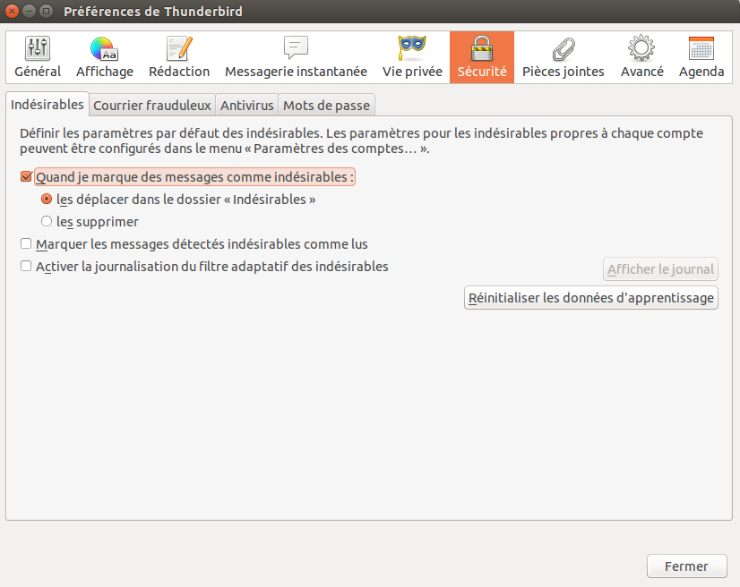
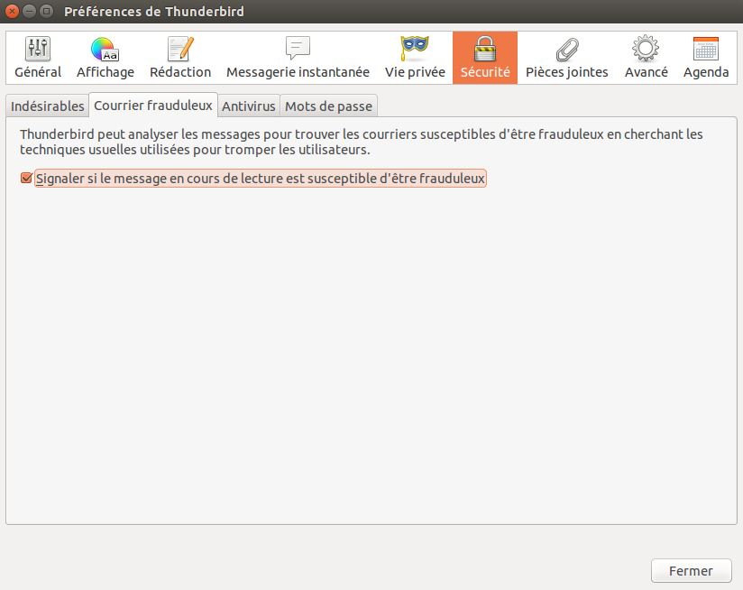
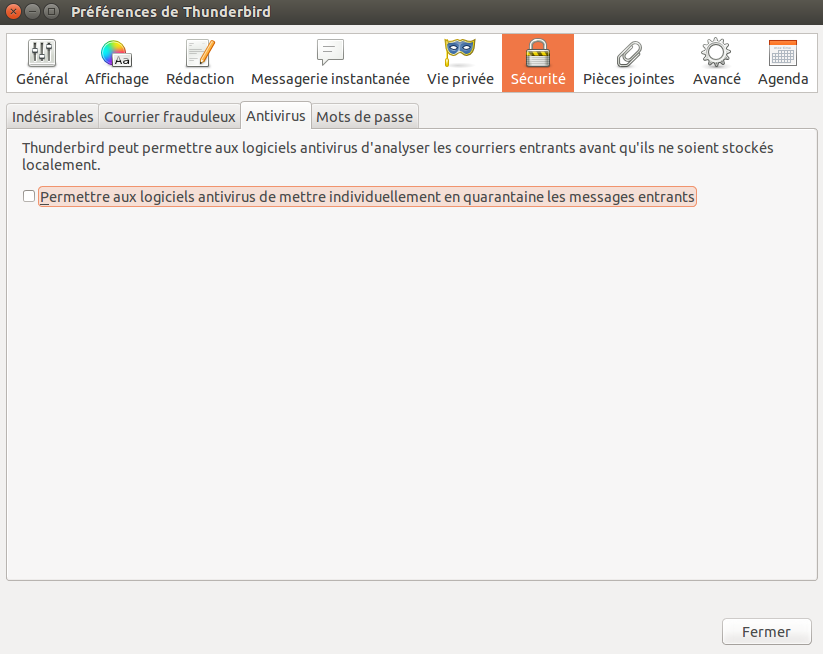
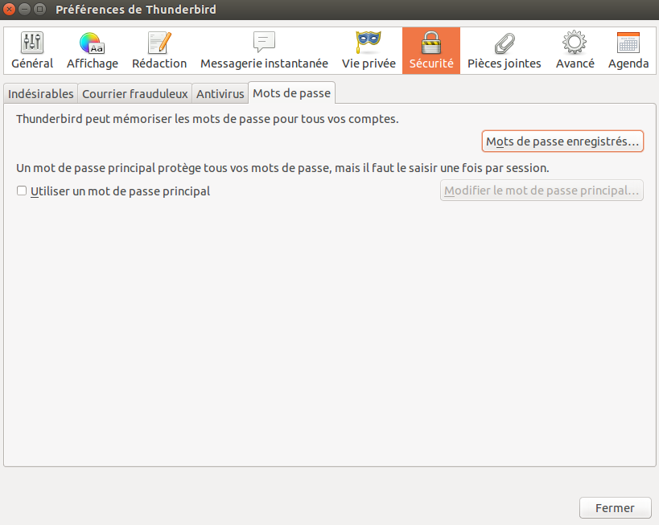
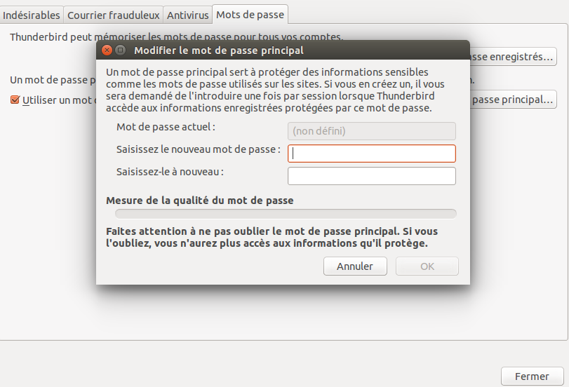
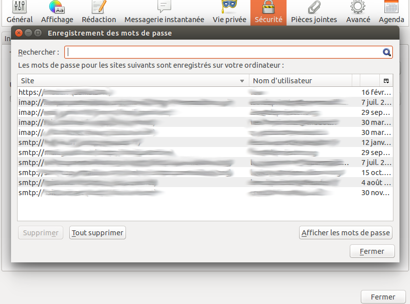
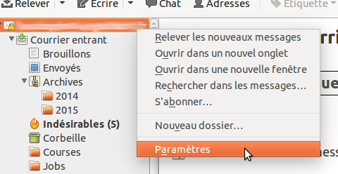
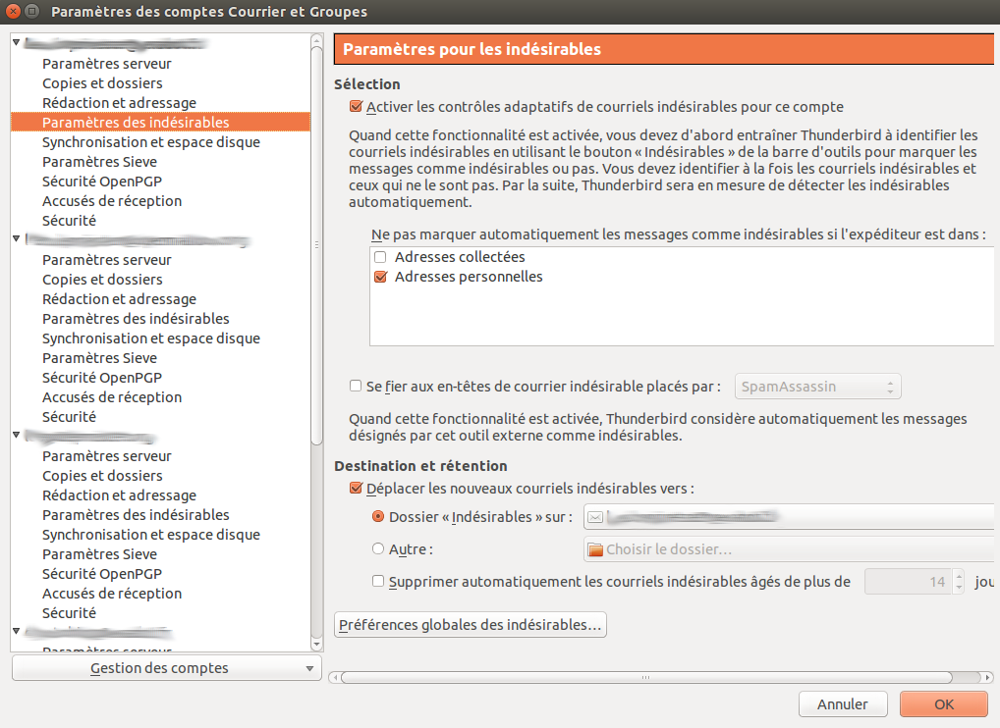

Quelques protections supplémentaires
====================================

Thunderbird apporte des mesures de sécurité supplémentaires pour vous protéger contre les spams, l'usurpation d'identité, les virus (avec l'aide de votre logiciel anti-virus, bien sûr) et les sites web dangereux.

Nous examinerons ces fonctionnalités mais avant il faut comprendre pourquoi vous avez besoin de certaines protections : 

 * **Le contrôle adaptatif des courriers indésirables**. Cela vous permet d'entrainer Thunderbird à identifier les courriers indésirables (SPAMS) et les retirer de votre boîte de réception. Vous pouvez aussi marquer des messages comme spam si votre fournisseur de service à laisser passer un e-mail indésirable.
 * **Intégration avec les logiciels anti-virus** . Si votre anti-virus supporte Thunderbird, vous pouvez l'utiliser pour mettre en quarantaine les e-mails contenant des virus. La liste des anti-virus qui supportent Thunderbird est disponible à cette adresse : [http://kb.mozillazine.org/Antivirus_software](http://kb.mozillazine.org/Antivirus_software)
 * **Mot de passe maître**. Pour votre confort, Thunderbird peut enregistrer les mots de passe de vos comptes. Vous pouvez ajouter un mot de passe maître que vous devrez entrer à chaque fois que vous lancez Thunderbird. Ainsi, Thunderbird ne pourra ouvrir vos comptes sauvegardés qui si vous avez entré le bon mot de passe.
 * **Limiter les cookies**. Certains blogs et sites web tentent d'envoyer des cookies (une ligne de texte qui représente des données utiles pour certains sites web) avec leurs flux RSS. Ces cookies sont souvent utilisés par les fournisseurs de contenu afin d'envoyer de la publicité ciblée. Thunderbird rejete les cookies par défaut mais vous pouvez le configurer pour qu'il accepte certains ou tous les cookies.

Dans la section Sécurité des préférences Thunderbird, vous pouvez configurer ces fonctionnalités.

 * Sur Windows et Mac OS X, allez dans le menu 'Outils' puis cliquez sur 'Options'.
 * Sur Ubuntu ou d'autres distributions GNU/Linux, allez dans le menu 'Édition' puis cliquez sur 'Préférences'.

Configuration des courriers indésirables
----------------------------------------

 1. Dans l'interface de configuration de Thunderbird, cliquez sur 'Sécurité' puis sur l'onglet 'Indésirables'.
 
 

 2. Faites les choses suivantes :
 
    * Pour dire à Thunderbird ce qu'il doit faire lorsque qu'un e-mail est marqué comme indésirable, sélectionnez l'option 'Quand je marque des messages comme indésirables'. 
    * Pour lui dire de déplacer ces messages vers le dossier 'Indésirables', sélectionnez l'option 'les déplacer dans le dossier "Indésirables"'.
    * Pour lui dire de supprimer les courriers indésirables lorsque qu'ils arrivent, sélectionnez l'option 'les supprimer'.
 
 3. Thunderbird marquera les courriers indésirables comme lus si vous sélectionnez l'option 'Marquer les messages détectés indésirables comme lus'.
 4. Si vous voulez garder une trace des spams reçus, sélectionnez l'option 'Activer la journalisation du filtre adaptatif des indésirables'.
 5. Cliquez sur le bouton 'Fermer' pour fermer l'interface de configuration. 

Détection de courriers fraduleux et système d'alerte
----------------------------------------------------

 1. Dans l'interface de configuration de Thunderbird, cliquez sur 'Sécurité' puis sur l'onglet 'Courrier frauduleux'.

 

 2. Pour dire à Thunderbird de vous alerter en cas de courriers potentiellement frauduleux, sélectionnez l'option 'Signaler si le message en cours de lecture est susceptible d'être frauduleux'.
 
 3. Cliquez sur le bouton 'Fermer' pour fermer l'interface de configuration.

L'intégration de votre anti-virus
---------------------------------

 1. Dans l'interface de configuration de Thunderbird, cliquez sur 'Sécurité' puis sur l'onglet 'Antivirus'.
 
 

 2. Pour activer l'intégration de votre anti-virus, sélectionnez l'option 'Permettre aux logiciels antivirus de mettre individuellement en quarantaine les messages entrants'. Pour désactiver cette fonctionnalité, il vous suffit de décocher l'option. 
 
 3. Cliquez sur le bouton 'Fermer' pour fermer l'interface de configuration.

Ajouter un mot de passe maître
------------------------------

 1. Dans l'interface de configuration de Thunderbird, cliquez sur 'Sécurité' puis sur l'onglet 'Mots de passe'.
 
 

 2. Cochez l'option 'Utiliser un mot de passe principal'.
 3. Entrez votre mot de passe dans les champs 'Saisissez le nouveau mot de passe' et 'Saisissez-le à nouveau'.
 
 

 4. Cliquez sur 'OK' pour fermer l'interface et enregistrer le nouveau mot de passe. 
 5. Si vous voulez voir les mots de passe que vous avez enregistrés dans Thunderbird, cliquez sur 'Mots de passe enregistrés'. L'interface 'Enregistrement des mots de passe' s'ouvre alors.
 
 

 6. Pour voir les mots de passe, cliquez sur 'Afficher les mots de passe'.
 7. Cliquez sur le bouton 'Fermer' pour fermer l'interface.
 8. Cliquez sur le bouton 'OK' pour fermer l'interface de configuration de Thunderbird.

Un contrôle adaptatif des courriers indésirables
------------------------------------------------

Vous allez avoir besoin d'ouvrir l'interface de configuration de comptes. Notez que vous devez choisir un compte à configurer via cette interface car il n'est pas possible de modifier les paramètres de tous les comptes en même temps. 

 1. Dans la colonne de gauche, faites un clic droit sur le nom d'un compte puis choisissez 'Paramètres' dans le menu. Si vous êtes sur Windows ou Mac, vous pouvez aussi cliquer sur 'Outils -> Paramètres des comptes' ou, sur GNU/Linux, 'Édition -> Paramètres des comptes'.
 
 

 2. Pour configurer le traitement adaptatif des courriers indésirables, choisissez un compte et cliquez sur 'Paramètres des indésirables'.

 

 3. Pour activer le contrôle, cochez l'option 'Activer les contrôles adaptatifs de courriels indésirables pour ce compte'. Pour le désactiver, il suffit de décocher la case.
 4. Vous pouvez ignorer le contrôle des e-mails provenant des personnes de votre carnet d'adresses en cochant la case 'Adresse personnelles'.
 5. Pour utiliser un filtre d'e-mails comme SpamAssassin ou SpamPal, cochez la case 'Se fier aux en-têtes de courrier indésirable placés par :' et choisissez un filtre dans le menu.
 6. Cochez l'option 'Déplacer les nouveaux courriels indésirables vers :' si vous voulez dépacer automatiquement les spams vers un dossier dédié. Vous devrez également sélectionner un dossier de destination présent soit chez votre fournisseur de service, soit localement.
 7. Cochez l'option 'Supprimer automatiquement les courriels indésirables âgés de plus de' si vous voulez que votre dossier de spams soit vidé régulièrement. Vous pouvez définir une durée en choisissant un autre nombre de jours dans le champs à disposition.
 8. Cliquez sur 'OK' pour enregistrer vos modifications.
 
