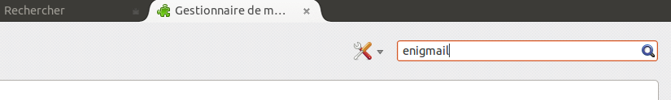

Installation de PGP sur Windows
===============================

Maintenant, nous allons compliquer un peu les choses, PGP est un protocole utilisé par de nombreux logiciels pour chiffrer des emails mais pour pouvoir utiliser PGP avec Thunderbird, nous devons installer GPG (une implémentation libre du protocole PGP) et Enigmail (une extension de Thunderbird) ... Vous êtes perdu ?
Ne vous inquiêtez pas, tout ce que vous avez à savoir c'est qu'il faut installer GPG et Enigmail pour pouvoir chiffrer vos emails.

Installation de PGP (GPG) sur Windows
-------------------------------------

Le logiciel GPG (GNU Privacy Guard ou GnuPG) est nécessaire pour envoyer des emails chiffrés.

Rendez-vous sur le site web du projet GPG4Win : [https://www.gpg4win.org/](https://www.gpg4win.org/).

Cliquez sur le gros bouton vert pour accèder à la page de téléchargement.

Cliquez ensuite sur le premier bouton vert qui correspond à la dernière version du logiciel.

Le téléchargement d'un fichier .exe démarrera. En fonction de votre navigateur, vous devrez peut-être cliquer sur le fichier téléchargé (nommé de cette manière : `gpg4win-2.1.0.exe`) afin de démarrer l'installation. Windows vous demandera si vous êtes sûr de vouloir installer ce programme. Répondez oui.

Complètez ensuite l'installation en acceptant la licence, en choisissant votre langue et, à moins que vous ayez une raison de ne pas le faire, en acceptant les options par défaut.

L'installeur vous demandera où vous voulez installer l'application sur votre ordinateur. La configuration par défaut devrait être correct mais notez tout de même l'emplacement au cas où vous en auriez besoin plus tard. Cliquez sur 'Suivant' une fois l'installation terminée.

Installation de l'extension Enigmail
------------------------------------

Une fois que le logiciel **PGP** est installé comme nous l'avons décrit ci-dessus, vous devez installer le module **Enigmail**.

Enigmail est une extension pour Thunderbird qui vous permet de protéger la confidentialité de vos conversations par emails. C'est simplement une interface qui vous permet d'utiliser PGP directement dans Thunderbird.

Enigmail est basé sur du chiffrement asymétrique.
Dans cette méthode, chaque utilisateur doit générer une paire de clés personnelles.
Il y a une clé privée qui est protégée par un mot de passe ou une phrase de passe et que vous ne devez pas partager.

Il y a également une clé publique. Celle ci peut être partagée avec tous vos correspondants. Une fois que vous avez la clé publique d'une personne, vous pouvez lui envoyer des emails chiffrés.
Elle sera la seule en mesure de déchiffrer et lire vos emails car elle sera la seule personne disposant de la clé privée correspondant à la clé publique utilisée.

De la même façon, si vous envoyez une copie de votre clé publique à vos contacts et que vous gardez votre clé privée secrète, vous serez la seule personne capable de lire les emails de vos contacts.

Enigmail vous permet aussi d'ajouter une signature numérique dans vos messages.
Le destinataire de votre message qui a une copie de votre clé publique pourra vérifier que l'email provient de vous et qu'il n'a pas été modifié en cours de route.
De la même manière, si vous avez la clé publique de votre correspondant, vous pouvez vérifier la signature numérique de ses messages.

Les étapes d'installation
-------------------------

Pour installer Enigmail, suivez les étapes :

 1. Ouvrez **Thunderbird** et sélectionnez `Outils > Modules complémentaires` pour ouvrir le gestionnaire des modules complémentaires.

 2. Entrez "Enigmail" dans la barre de recherche comme ci-dessous et cliquez sur l'icône de recherche.

 

 3. Cliquez sur le bouton "Ajouter à Thunderbird" pour démarrer l'installation.

 4. Thunderbird vous demandera si vous êtes sûr de vouloir installer cette extension. Nous avons confiance en cette application donc cliquez sur le bouton "Installer maintenant".

 

 5. Après quelques secondes, l'installation devrait se terminer et la fenêtre suivante devrait apparaître. Cliquez sur bouton "Redémarrer Thunderbird".

 
