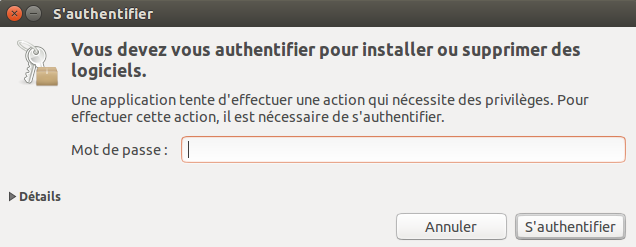

Installation de PGP sur Ubuntu
==============================

Nous allons utiliser la logithèque d'Ubuntu pour installer PGP (Enigmail et ses composants). Pour commencer, ouvrez la logithèque grâce au menu Unity en tapant 'logithèque' dans la barre de recherche.

Cliquez sur "Logithèque Ubuntu".

Tapez "Enigmail" dans la barre de recherche de la logithèque et l'extension Enigmail devrait apparaître. Cliquez sur "Installer" et authentifiez vous pour continuer.

Entrez votre mot de passe et cliquez sur "S'authentifier". L'installation devrait démarrer.

Une fois l'installation terminée, la barre de progression devrait disparaître. Enigmail est maintenant installé.
