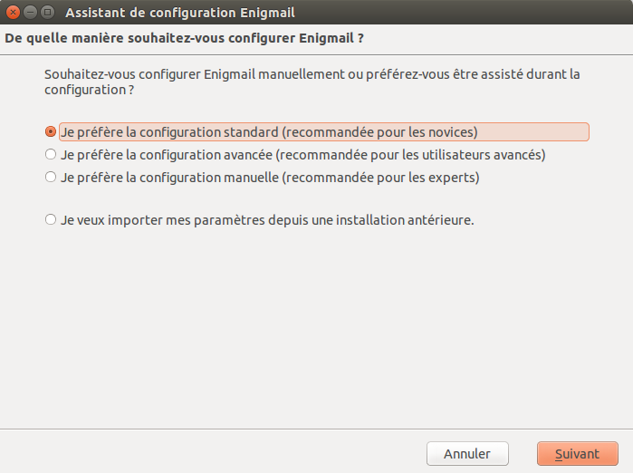
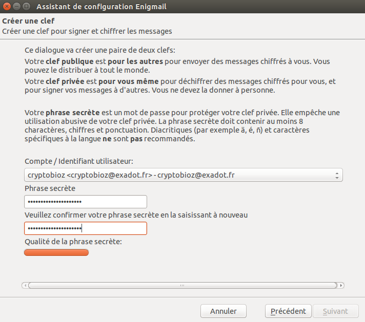
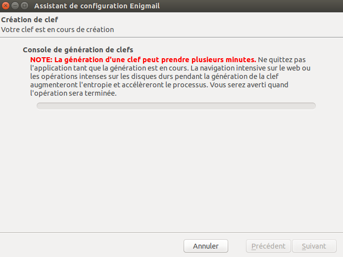

Génération des clés PGP
=======================

Enigmail possède un assistant qui vous aide à générer une paire de clés (reportez vous à la section d'introduction à PGP pour les explications). Vous pouvez démarrer cet assistant quand vous le voulez dans Thunderbird en cliquant sur `Enigmail > Assistant de configuration`.

 1. Voici à quoi ressemble l'assistant. Lisez bien le texte présent sur chaque fenêtre, il vous apporte des informations utiles et vous aide à configurer PGP en fonction de vos préférences. Dans la première fenêtre, cliquez sur "Suivant" pour démarrer la configuration.

 

 2. Dans cette fenêtre, sélectionnez l'un de vos comptes email (si vous n'en avez qu'un, il sera sélectionné par défaut). Dans le champ "Phrase secrète", vous devez entrer un mot de passe. C'est un *nouveau* mot de passe qui est utilisé pour protéger votre clé privée. Il est **très important** de retenir ce mot de passe car, sinon, vous ne pourrez plus lire vos emails chiffrés. Choisissez un mot de passe **fort**, idéalement plus de 20 caractères. Reportez vous au chapitre sur les mots de passe pour avoir de l'aide afin d'en créer un unique, long et simple à se souvenir. Après avoir sélectionné votre compte et créer un mot de passe, cliquez sur le bouton "Suivant".

 

 3. Vos clés vont être générées par l'assistant ce qui peut prendre un peu de temps. Une fois la génération terminée, cliquez sur le bouton "Suivant".

 

 8. Maintenant que vous avez votre paire de clés PGP. L'assistant vous demandera si vous voulez également créer un 'certificat de révocation'. Si votre clé privée est compromise (par le vol de votre ordinateur par exemple), ce fichier pourra être utilisé pour informer les autres utilisateurs que l'on ne peut plus faire à cette paire de clés. C'est une sorte de 'kill switch' pour votre identité PGP. Vous pourriez aussi révoquer votre clé car vous avez généré une nouvelle identité et que l'ancienne est devenue obsolète.
 
 

 9. Si vous décidez de générer un certificat de révocation, l'assistant vous demandera l'emplacement de sauvegarde du fichier. La fenêtre qui s'affichera sera différente suivant votre système d'exploitation. Il vaut mieux renommer le fichier en quelque chose de plus évident comme mon_certificat_de_revocation. Cliquez sur 'Enregistrer' une fois que c'est terminé.
 
 

 10. Si vous avez décidé de générer un certificat de révocation, l'assistant vous informera si tout s'est bien déroulé. Vous devriez l'imprimer ou la graver sur un CD et la garder dans un endroit sûr.

 

 11. L'assistant vous informera si tout s'est bien déroulé.

 

Félicitations, vous avez maintenant un client mail totalement compatible avec PGP et configuré pour l'utiliser. Dans le prochain chapitre, nous expliquerons comment gérer ses clés, signer des messages et les chiffrer. Thunderbird peut vous aider et faire beaucoup de choses automatiquement.
