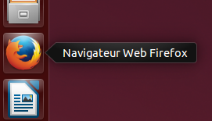
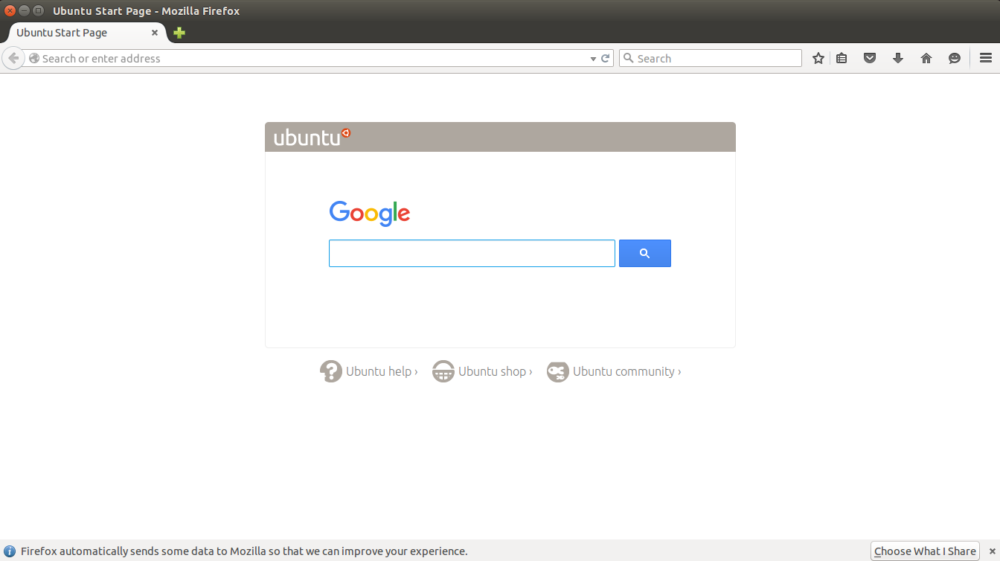

Utiliser Firefox sur Ubuntu
===========================

Firefox est pré-installé sur Ubuntu par défaut. Pour l'ouvrir, cliquez sur l'icône Firefox dans le lanceur Unity :

Firefox démarre et affiche une page de bienvenue :

