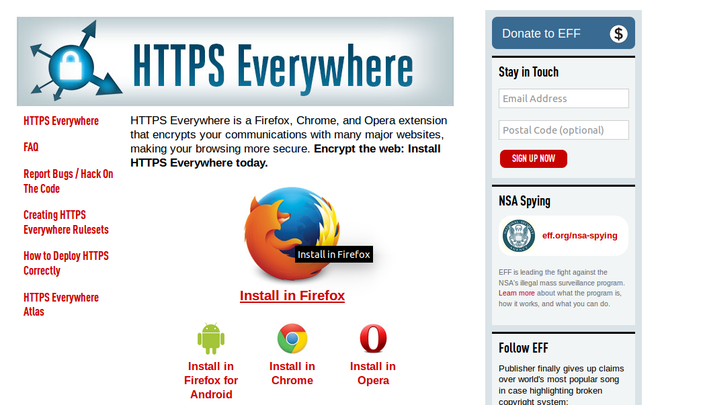
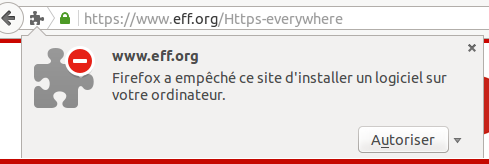
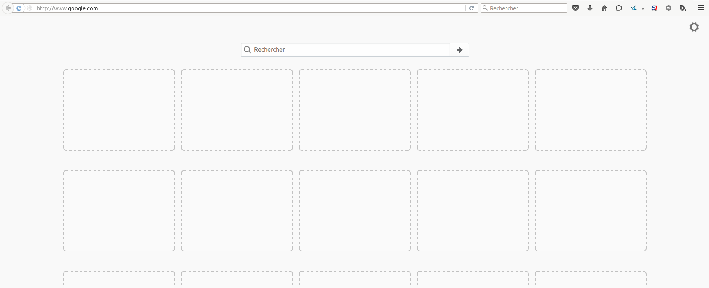
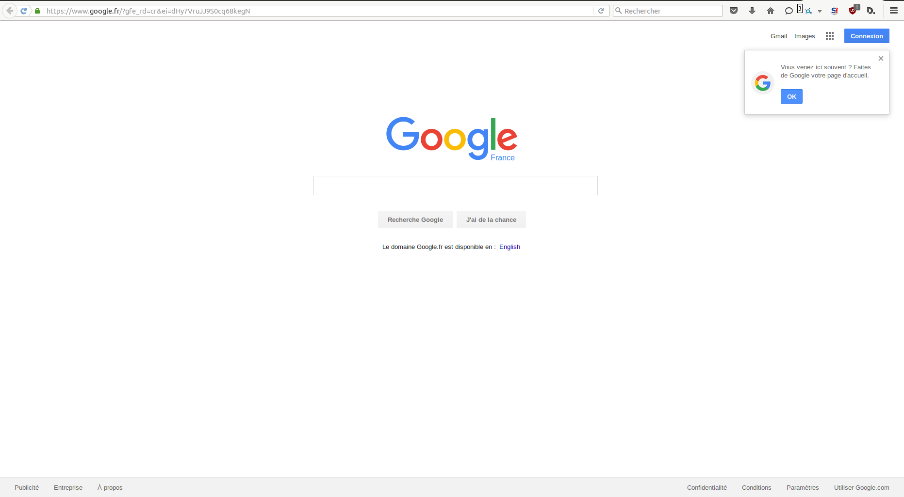

Augmenter Firefox
=================

Un fois le téléchargement et l'installation de Firefox terminé, vous pouvez d'ores et déjà faire toutes les choses basiques que permettent les navigateurs.
Vous pouvez aussi ajouter des outils ou changer la façon dont Firefox fonctionne en installant des modules, des petits ajouts qui augmentent la puissance de Firefox.

Ces modules peuvent améliorer votre navigation mais peuvent aussi collecter et transmettre vos informations. Avant d'en installer un, vérifiez bien qu'il provient d'une source de confiance. Autrement, il pourrait partager des informations à propos de vous, garder une sauvegarde des sites visités ou même nuire à votre ordinateur sans que vous le sachiez.

Il y a plusieurs types de modules :

 * Les *extensions* ajoutent des fonctionnalités à Firefox
 * Les *thèmes* changent l'apparence de Firefox
 * Les *plugins* aident Firefox à faire des choses qu'il ne sait pas faire par défaut (par exemple, lire des vidéos flash ou des applications Java)

Pour rester dans le sujet du livre, nous allons uniquement parler des extensions.
Nous en verrons quelques unes particulièrement utiles pour se protéger sur Internet.
Il y a une énorme variété d'extensions.
Vous pouvez ajouter des dictionnaires pour différentes langues, obtenir la météo d'autres pays, obtenir des suggestions de sites à visister selon vos préférences et beaucoup d'autres.
Firefox garde une liste des extensions disponibles sur son site ([https://addons.mozilla.org/firefox](https://addons.mozilla.org/firefox)) mais vous pouvez aussi les rechercher par catégories sur le site [https://addons.mozilla.org/firefox/browse](https://addons.mozilla.org/firefox/browse).

**Attention :** Nous recommandons de n'installer que des extensions disponibles sur le site de Firefox.
De plus, vous ne devriez jamais installer Firefox à moins d'avoir récupéré les fichiers d'installation depuis un source de confiance.
Il est important de préciser qu'utiliser Firefox sur un ordinateur qui ne vous appartient pas augmente votre vulnérabilité.
Sachez que vous pouvez installer Firefox sur un CD ou une clé USB (allez voir notre chapitre sur ce problème).

Bien qu'aucun outil ne peut vous protéger complètement contre toutes les menaces qui pèsent sur votre vie privée et votre sécurité en ligne, les extensions Firefox décritent dans ce chapitre peuvent réduire considérablement votre exposition aux menaces les plus communes et augmenter vos chances de rester anonyme.

HTTPS Everywhere
----------------

HTTP est considéré comme dangereux car les communications sont transmisent en texte clair (en texte lisible).
Beaucoup de sites sur le Web proposent l'utilisation du chiffrement au dessus d'HTTP (HTTPS) mais il peut être difficile à utiliser.
Par exemple, ils peuvent permettre la connexion en HTTP par défaut même lorsque le HTTPS est disponible. Ils peuvent aussi envoyer des pages en HTTPS mais utiliser des liens qui pointent vers la version non sécurisée du site.
L'extension HTTPS Everywhere supprime ces problèmes en réécrivant toutes les requêtes vers ces sites pour forcer l'utilisation d'HTTPS.
Bien qu'elle se nomme "HTTPS Everywhere", l'extension ne force l'utilisation d'HTTPS que pour une liste de sites définie et ne peut fonctionner que si le site supporte le chiffrement.
Il ne peut pas créer une connexion sécurisé avec un site si ce dernier n'offre pas la possibilité d'utiliser HTTPS.

Notez que certains de ces sites inclus toujours beaucoup de contenus comme des images ou des icônes qui proviennent d'autres sites web qui ne supportent pas forcément HTTPS.
Comme toujours, si l'icône de cadenas du navigateur est cassée ou porte un point d'exclamation, vous restez vulnérable à certains adversaires qui utilisent des attaques actives ou d'analyse de trafic.
Cependant, l'effort nécessaire pour surveiller votre navigation devrait être encore augmenté.

Certains sites web (comme GMail) demande l'utilisation d'HTTPS par défaut mais l'utilisation d'HTTPS Everywhere vous protégera aussi des attaques dites de "TLS/SSL-stripping" dans lesquels un attaquant vous cache la version HTTPS du site si vous essayer d'utiliser la version HTTP.

Vous pouvez obtenir des informations complémentaires sur : [https://www.eff.org/https-everywhere](https://www.eff.org/https-everywhere).

Installation
------------

Commencez par télécharger l'extension depuis son site officiel : [https://www.eff.org/https-everywhere](https://www.eff.org/https-everywhere)

Selectionnez la version la plus récente. Dans l'exemple ci-dessous, c'est la version 2.2 mais une version plus récente pourrait être disponible aujourd'hui.

Cliquez sur "Autoriser". Vous devrez redémarrer votre navigateur en cliquant sur le bouton "Redémarrer maintenant". HTTPS Everywhere est installé.

Usage
-----

Une fois installée, l'extension s'utilise très simplement et de façon transparente. Tapez une url en HTTP (par exemple, [http://www.google.com](http://www.google.com)).

Appuyez sur Entrer. Vous serez automatiquement redirigé vers le site web en HTTPS (dans cet exemple : [https://www.google.com](https://www.google.com)). Il n'y a rien d'autre à faire.

Si le réseau bloque le HTTPS
----------------------------

Votre fournisseur d'accès Internet peut décider de bloquer les versions sécurisées de différents sites afin d'augmenter sa capacité à surveiller ce que vous faites.
Dans ces cas là, HTTPS Everywhere pourra vous empêcher d'utiliser ces sites car il oblige le navigateur à utiliser la version sécurisé de ces derniers.
(Par exemple, nous avons entendu parler d'un réseau WiFi dans un aéroport qui autorisait seulement les connexions HTTP.
Peut-être que les opérateurs du réseau était intéressés par ce que les utilisateurs faisaient dessus. Et dans cet aéroport, les utilisateurs d'HTTPS Everywhere n'étaient pas capable de ce connecter sur certains sites web à moins de désactiver temporairement l'extension.)

Dans ce scénario, vous pourriez choisir d'utiliser HTTPS Everywhere avec des outils comme Tor ou un VPN pour contourner les blocages.

L'ajout de support pour d'autres sites
--------------------------------------

Vous pouvez ajouter vos propres règles à l'extension pour vos sites web favoris.
Il existe une page d'explication sur comment le faire à cette adresse : [https://www.eff.org/https-everywhere/rulesets](https://www.eff.org/https-everywhere/rulesets).
L'avantage d'écrire des règles est de permettre à HTTPS Everywhere de s'assurer que vous vous connectez bien aux sites sécurisés.
Mais souvenez vous : HTTPS Everywhere ne vous permet d'utiliser le chiffrement que si les administrateurs des sites ont mis en place des versions disponibles en HTTPS.
Si un site ne le supporte pas, l'ajout d'une règle n'a aucun intérêt.

Si vous administrez un site web ayant une version HTTPS de disponible, vous pouvez envoyer l'adresse de votre site aux développeurs d'HTTPS Everywhere.

Adblock Plus
------------

Adblock Plus ([http://www.adblockplus.org](http://www.adblockplus.org)) est principalement connu en tant que bloqueur de publicité sur les sites web.
Mais il est aussi capable de bloquer d'autres contenus qui peuvent vous traquer.
Pour rester à jour sur les nouvelles menaces, Adblock Plus utilise des listes noires maintenues par des volontaires.

Info geek supplémentaire : Comment Adblock Plus fait-il pour bloquer des adresses ?

Le plus gros du travail est aujourd'hui fait par Gecko, le moteur de Firefox, Thunderbird et d'autres applications.
Il y a quelque chose nommé les "content policies".
Une "content policy" est un simple bout de code Javascript (ou C++) appellé lorsque le navigateur charge une page web.
Il regarde si les données qui doivent être chargées et décide si elles doivent être autorisées ou pas.
Il y a un certain nombre de "content policies" basiques dans les navigateurs (lorsque vous définissez les sites qui ne doivent pas afficher des images dans Firefox ou SeaMonkey, vous configurez l'une de ces "content policies") et toutes les extensions peuvent en ajouter.
Donc Adblock Plus n'a besoin que d'ajouter ses règles de "content policies" et, de cette manière, un seul logiciel décidera quelles adresses il faut bloquer.

Commencer avec Adblock Plus
---------------------------

Une fois Firefox installé :

 1. Téléchargez la dernière version d'Adblock Plus depuis la liste des extensions fournie par Firefox
 2. Confirmez que vous voulez installer Adblock Plus en cliquant sur "Installer maintenant"
 3. Après l'installation, Firefox devra redémarrer.

Créer des filtres personnalisés
-------------------------------

Adblock Plus vous permet de créer vos propres filtres.
Pour en ajouter un, allez dans les préférences d'Adblock Plus et cliquez sur "Ajouter un filtre" en bas à droite de la fenêtre.
Les filtres personnalisés ne pourront pas forcément remplacer les listes noires communautaires comme EasyList mais elles sont très utiles pour bloquer des contenus qui ne sont pas couverts dans les listes publiques.
Par exemple, si vous souhaitez supprimer les interactions entre les sites web et Facebook, vous pouvez ajouter le filtre suivant :

    ||facebook.*$domain=~facebook.com|~127.0.0.1

La première partie (`||facebook.*`) permet de bloquer tout ce qui vient des noms de domaine de Facebook.
La seconde partie (`$domain=~facebook.com|~127.0.0.1`) est une exception qui permet de ne rien bloquer lorsque l'on est sur le site de Facebook ou lorsque les requêtes proviennent de l'adresse IP 127.0.0.1 (votre ordinateur) afin de garder certaines fonctionnalités de Facebook.

Un guide pour aprendre à créer ses propres filtres Adblock Plus est disponible à l'adresse [http://adblockplus.org/en/filters](http://adblockplus.org/en/filters).

Activer et désactiver Adblock Plus pour des éléments ou des sites web spécifiques
---------------------------------------------------------------------------------

Vous pouvez voir les éléments identifiés par Adblock Plus en cliquant sur l'icône APB dans votre navigateur (la plupart du temps à côté de la barre de recherche) et cliquez sur "Ouvrir la liste des éléments filtrables".
Une fenêtre en bas du navigateur va vous permettre d'activer ou désactiver chaque élément au cas par cas.
Vous pouvez aussi désactiver Adblock Plus pour un nom de domaine ou une page web spécifique en cliquant sur l'icône APB et en cochant l'option "Désactiver pour [le nom de domaine]" ou "Désactiver pour cette page uniquement".

Les autres extensions qui peuvent améliorer votre sécurité
----------------------------------------------------------

La liste ci-dessous regroupe des extensions dont on ne parlera pas dans ce livre mais qui sont utiles pour vous protéger.

 * **Flagfox** - affiche le drapeau du pays où est situé le serveur hébergeant le site web visité. [https://addons.mozilla.org/en-US/firefox/addon/flagfox/](https://addons.mozilla.org/en-US/firefox/addon/flagfox/)

 * **BetterPrivacy** - gère les "cookies" utilisés pour vous traquer durant votre navigation. Les cookies sont des petits bouts d'informations stockés dans votre navigateur. Certains d'entre eux permettent aux annonceurs de savoir quels sites vous visitez. [https://addons.mozilla.org/en-US/firefox/addon/betterprivacy/](https://addons.mozilla.org/en-US/firefox/addon/betterprivacy/)

 * **GoogleSharing** - évite que Google puisse connaître votre historique de recherche. [https://addons.mozilla.org/en-us/firefox/addon/googlesharing/](https://addons.mozilla.org/en-us/firefox/addon/googlesharing/)
