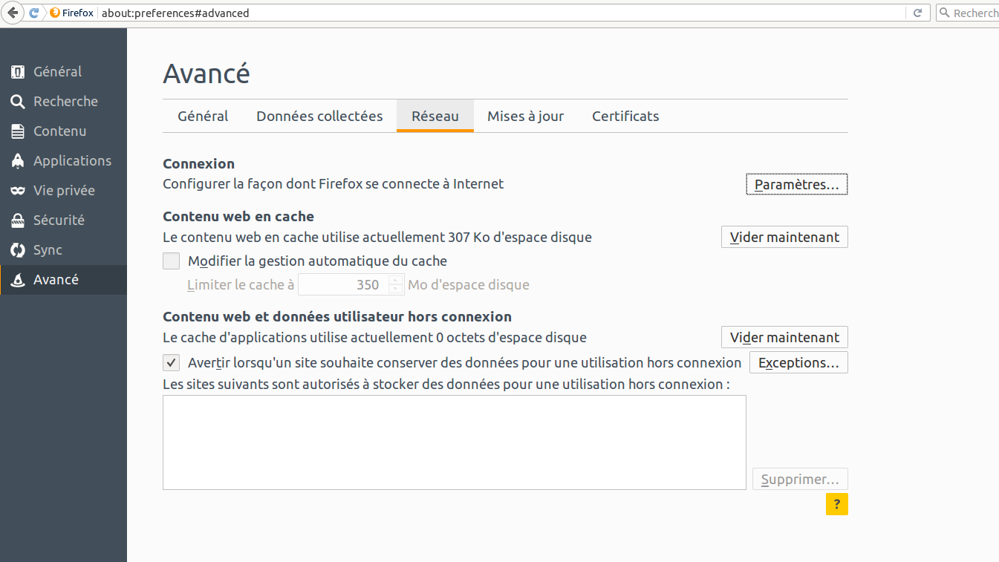
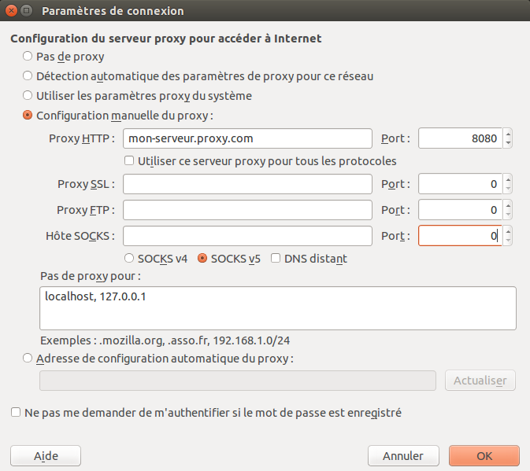

Paramètres du proxy
===================

Un serveur proxy vous permet d'accéder à un site web ou à un serveur même quand l'accès direct à ceux ci est bloqué dans votre pays ou par votre fournisseur d'accès Internet.
Il y a différents types de serveurs proxys :

 * Le proxy Web qui requiert seulement que vous connaissiez l'adresse du serveur proxy qui peut avoir une URL similaire à `http://proxy.com/cgi-bin/nph-proxy.cgi`.
 * Le proxy HTTP qui requiert de modifier les paramètres de votre navigateur. Ce type de proxy ne fonctionne que pour la navigation web. Les informations du serveur peuvent prendre cette forme `proxy.exemple.com:3128` ou celle ci `192.168.0.1:8080`.
 * Le proxy SOCKS qui requiert de modifier les paramètres de votre navigateur. Il fonctionne pour plusieurs applications Internet, y compris pour les messageries instantannées et les e-mails. Les informations des proxys SOCKS sont sous la même forme que pour les proxys HTTP.

Pour utiliser un proxy Web, vous n'avez qu'à entrer l'URL dans votre navigateur. Contrairement aux proxys HTTP et SOCKS pour lesquels vous devez configurer votre navigateur web.

Configuration d'un proxy sur Firefox
------------------------------------

Sur Firefox, vous pouvez changer les paramètres de connexion pour utiliser un serveur proxy.
Pour faire cela, vous devez ouvrir la fenêtre Préférences ou Options de Firefox.
Vous pouvez la trouver en allant la barre de menu et en cliquant sur `Éditions -> Préférences` sur Linux ou `Outils -> Options` sur Windows.

Allez dans la section Avancé et cliquez sur l'onglet Réseau.

Cliquez sur le bouton Paramètres, sélectionnez "Configuration manuelle du proxy" et entrez les informations du proxy que vous voulez utiliser.
Souvenez vous que les proxys HTTP et SOCKS fonctionnent différemments, vous devez remplir les bons champs en fonction du type de serveur.
Si il y a le symbole (:) dans les informations de votre serveur proxy, il sert à séparer l'adresse et le numéro de port.
Votre fenêtre devrait ressembler à ça :

Après avoir cliqué sur OK, votre configuration sera sauvegardée et votre navigateur se connectera automatiquement au serveur proxy.
Si vous obtenez un message comme "La connexion a été refusé par le serveur proxy" ou "Impossible de trouver le serveur proxy", c'est qu'il y a un problème avec votre configuration du proxy.
Dans ce cas, vous pouvez désactiver le proxy en ouvrant la fenêtre de configuration du réseau et en sélectionnant "Pas de proxy".
