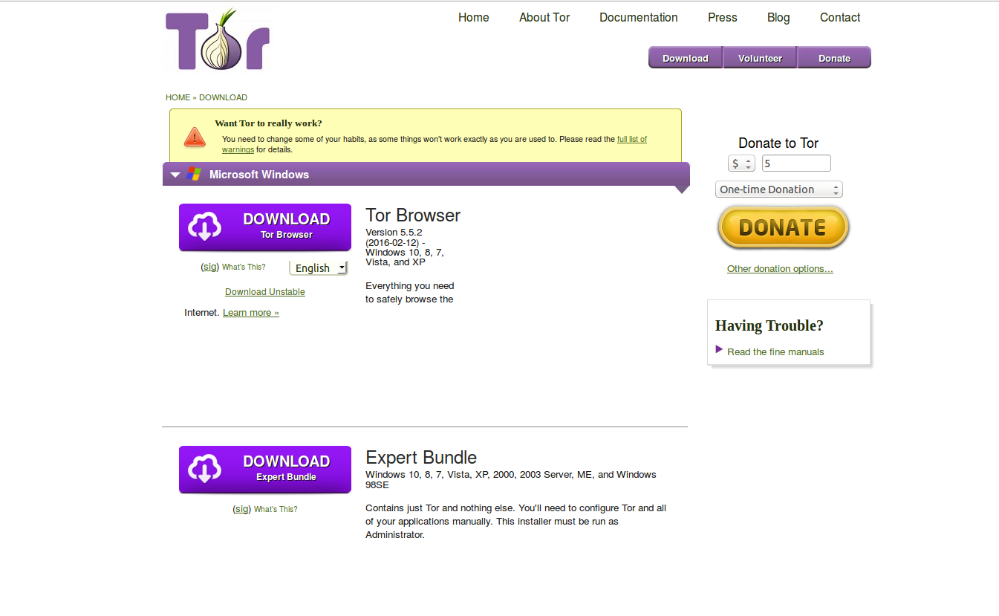
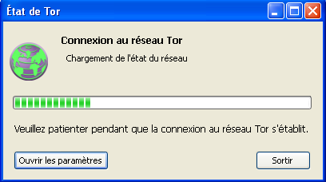
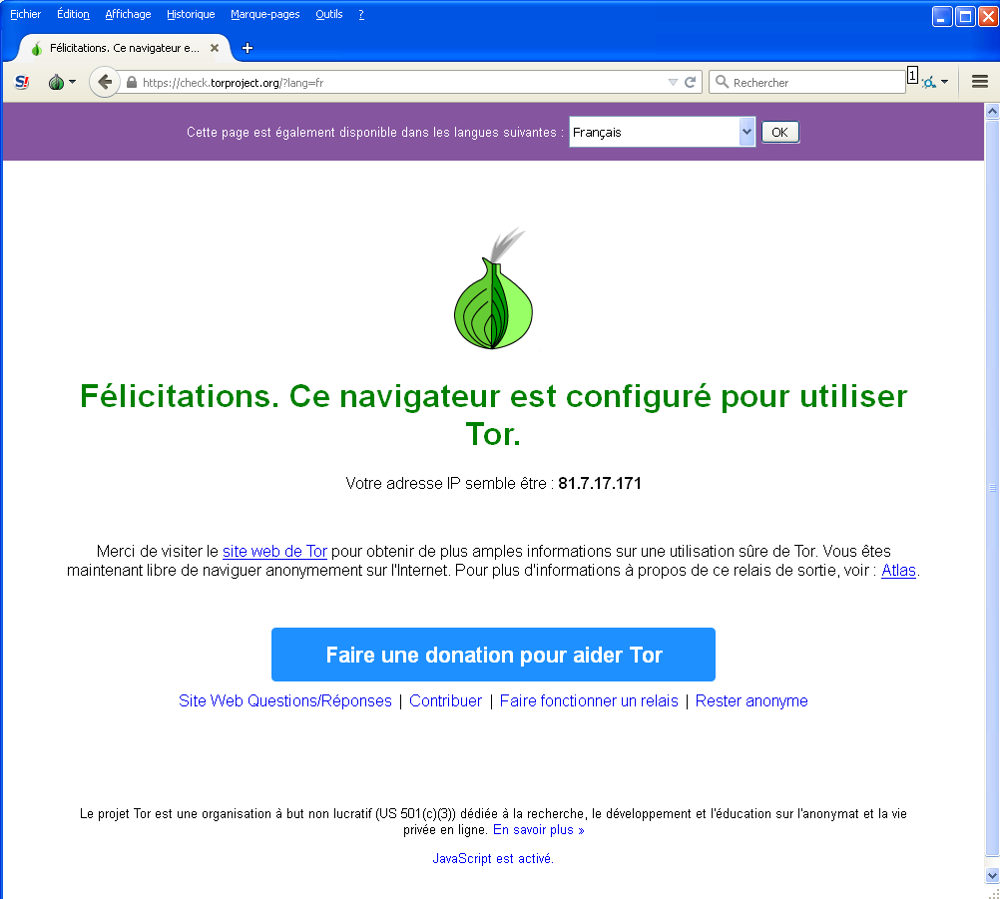
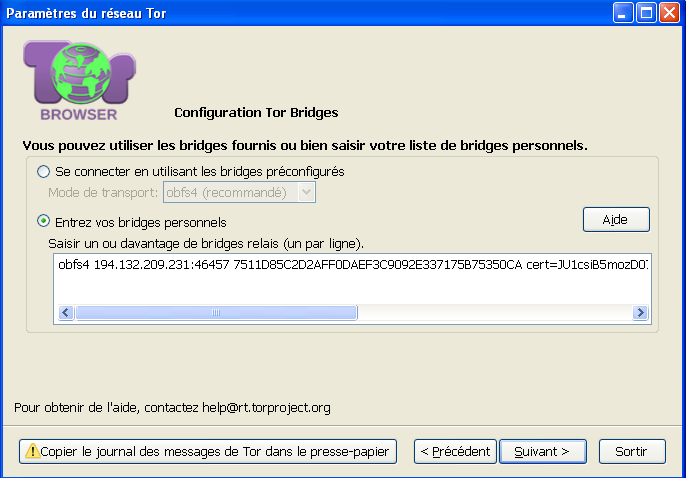

Utiliser Tor
============

Tor est un système imaginé pour permettre l'anonymat en ligne, composé d'un logiciel client et d'un réseau de serveurs qui peut cacher la localisation des utilisateurs et d'autres facteurs qui pourraient les identifier.
Imaginez un message enroulé dans plusieurs couches de protection : chaque serveur retire une couche et, ainsi, supprime les informations de l'expéditeur.

L'utilisation de ce système rend difficile la surveillance du trafic Internet des utilisateurs, y compris les sites web visités, les articles en ligne, les conversations instantannées, etc ...
Il vise à protéger la liberté des utilisateurs, leur vie privée ainsi que leur capacité à mener des affaires confidentielles, en protégeant leurs activités sur Internet contre la surveillance.
Le logiciel est open-source et l'utiilisation du réseau est gratuite.

Comme tous les autres réseaux d'anonymisation à faible latence, Tor ne peut pas et n'essaye pas de vous protéger contre la surveillance aux extrémités du réseau (le trafic entrant et sortant du réseau Tor).
Tor vous protège contre l'analyse de trafic mais il ne peut pas vous protéger contre le "traffic confirmation" (aussi appellé "end-to-end correlation")

Attention : Comme Tor ne chiffre pas le trafic entre le noeud de sortie et le serveur cible, n'importe quel noeud de sortie est capable de lire le trafic qui passe au chez lui si celui ci n'est pas chiffré de bout-en-bout avec TLS par exemple.
(Si votre postier est corrompu, il pourrait encore ouvrir l'enveloppe et lire le contenu).
Bien que cela ne viole pas forcément l'anonymat de la source, si les utilisateurs de Tor font des erreurs, ils peuveut devenir sujets d'interceptions de données par des tiers.
Donc : la localisation des utilisateurs reste caché, cependant, dans certains cas, le contenu est vulnérable à l'analyse au travers de laquelle des informations à propos des utilisateurs peuvent être récupérées.

Utiliser le Tor Browser Bundle
------------------------------

Le Tor Browser Bundle vous permet d'utiliser Tor sur Windows OS X et/ou Linux sans avoir besoin de configurer un navigateur web. Mieux encore, c'est aussi une application portable qui peut être lancée depuis une clé USB afin de pouvoir l'utiliser sur n'importe quel ordinateur sans devoir l'installer sur le disque dur.

Téléchargement du Tor Browser Bundle
------------------------------------

Vous pouvez télécharger le Tor Browser Bundle depuis le site web [torproject.org](https://www.torproject.org).

Si le site torproject.org est filtré de la où vous êtes, tapez "tor mirrors" dans votre moteur de recherche favoris : Les résultats devrait probablement vous donnez des alternatives pour télécharger le Tor Browser Bundle.

Attention : Après avoir téléchargé le Tor Bundle, vous devriez vérifier les signatures des fichiers, notamment si vous les avez téléchargés depuis les sites mirroirs. Cette vérification vous assure que les fichiers téléchargés ne sont pas différents de ceux fournis par le Projet Tor. Pour en apprendre plus sur les signatures et comprendre comment les vérifier, lisez [https://www.torproject.org/docs/verifying-signatures](https://www.torproject.org/docs/verifying-signatures).

(Vous pouvez aussi télécharger le logiciel GnuPG dont vous aurez besoin pour vérifier la signature sur cette page : [http://www.gnupg.org/download/index.en.html#auto-ref-2](http://www.gnupg.org/download/index.en.html#auto-ref-2))

Les instructions ci-dessous concernent l'installation du Tor Browser sur Windows. Si vous utilisez un autre système d'exploitation, rendez-vous sur le site torproject.org.

### Installation

 1. Dans votre navigateur web, entrez l'URL de téléchargement du Tor Browser : [https://www.torproject.org/download/download](https://www.torproject.org/download/download).

 

 2. Choisissez votre langue dans le menu déroulant et cliquez sur le bouton **Download Tor Browser**.

 3. Un fois le fichier téléchargé, double-cliquez dessus pour lancer l'application.

 4. Choisissez votre langue et cliquez sur OK.

 5. Suivez les instructions afin d'installer le logiciel.

 6. Une fois le Tor Browser installé, supprimez le fichier précédemment téléchargé.

Utilisation du Tor Browser
--------------------------

Avant de commencer :

 * **Fermer Firefox** Si Firefox est installé sur votre ordinateur, vérifiez qu'il n'est pas en train de tourner.

 * **Fermez Tor** Si Tor est déjà installé sur votre ordinateur, vérifiez qu'il n'est pas en train de tourner.

Lancez le Tor Browser :

 1. Double-cliquez sur l'icône **Start Tor Browser**. Une fois le panneau de contrôle de Tor ("Vidalia") ouvert cliquez sur le bouton **Se connecter**.

 

 2. Une fois que la connexion est établie, le navigateur va s'ouvrir et automatique se connecter à la page TorCheck pour vous confirmez que vous êtes connecté. Ceci peut prendre un peu de temps en fonction de la qualité de votre connexion Internet.

 

Surfer sur le Web avec le Tor Browser
-------------------------------------

Essayez de naviguer sur des sites web et voyez comment ils s'affichent. Le chargement des pages est plus long que d'habitude car votre connexion passe par plusieurs serveurs relais.

Si ça ne fonctionne pas
-----------------------

Si Firefox s'ouvre et affiche la page "Désolé. Vous n'utilisez pas Tor" comme sur l'image ci-dessous, cela signifie que vous n'utilisez pas le réseau Tor.

Si vous voyez ce message, fermez Firefox et le Tor Browser et recommencez.

Si Firefox ne se lance pas, une autre instance du navigateur pourrait interférer avec le Tor Browser. Pour règler ce problème :

 1. Ouvrez le gestionnaire des tâches. Pour cela, tout dépends de la manière dont votre ordinateur est configuré. Sur la plupart des systèmes, vous pouvez faire un clic droit sur la barre des tâches et cliquer sur le "Gestionnaire des tâches".
 2. Cliquez sur l'onglet "Processus".
 3. Cherchez un processus dans la liste nommé "firefox.exe".
 4. Si vous en voyez un, sélectionnez le et cliquez sur "Terminer le processus"
 5. Relancez le Tor Browser.

Si le Tor Browser ne fonctionne toujours pas après deux ou trois essais, c'est que Tor est peut-être bloqué par votre FAI et vous devriez essayer d'utiliser la fonction **bridge** de Tor.

Utilisation des Bridges Tor
---------------------------

Si vous ne pouvez toujours pas vous connecter, votre FAI filtre peut-être votre connexion et vous bloque l'accès au réseau Tor. Dans ce cas, l'utilisation d'un bridge Tor peut aider. Un bridge Tor est un relais qui n'est pas listé. Pour utiliser un bridge, la première étape consiste à trouver un serveur.

La façon la plus simple de trouver un bridge est d'aller sur le site du projet Tor ([https://bridges.torproject.org/](https://bridges.torproject.org/)), même si le site est bloqué, vous pouvez envoyer un email (depuis une adresse Gmail, Yahoo ou Riseup uniquement) à bridges@torproject.org avec la line "get bridges" dans le corps du message.

Une fois que vous avez un bridge (ou une liste de bridges), vous pouvez utiliser le panneau de configuration du réseau Tor pour l'ajouter. Cliquez sur le bouton **Oui** à la question "Est-ce que votre Fournisseur d'Accès Internet (FAI) bloque les connexions au réseau Tor", puis, cliquez sur le bouton **Suivant**. Cliquez ensuite sur **Entrer vos bridges personnels** et ajoutez les adresses de vos bridges dans la zone dédiée. Continuer la procédure en cliquant sur **Suivant** et suivez les instructions pour vous connecter au réseau Tor.

