Installer KeePass
=================

Nous allons voir l'installation de KeePass sur Ubuntu et Windows.

Mac OSX possède, par défaut, un excellent gestionnaire de mots de passe appelé Keychain qui est tout aussi sûr. Cependant, il y a deux inconvénients majeurs, il n'est pas Open Source et il ne fonctionne pas sur les autres systèmes. Si vous avez besoin de transférer vos mots de passe d'un système d'exploitation à un autre, il est préférable d'utiliser KeePass partout. Comment utiliser Keychain est expliqué dans le prochain chapitre.

Installer KeePassX sur Ubuntu
-----------------------------

Pour l'installer sur Ubuntu, nous allons utiliser la logithèque. Tapez KeePass dans la barre de recherche en haut à droite et l'application KeePassX devrait apparaître automatiquement dans la liste.

Sélectionnez l'élément (il peut-être sélectionné par défaut) et cliquez sur "Installer". On vous demandera alors d'autoriser l'installation :

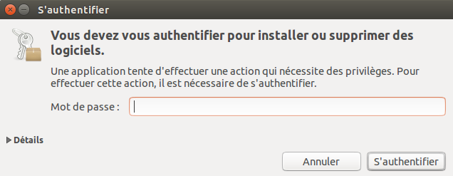

Entrez votre mot de passe et cliquez sur "S'authentifier", l'installation démarrera alors.

Ubuntu n'offre pas de retour pour savoir si le logiciel a bien été installé. Si la barre de progression à gauche a disparu et que le barre de progression à droite n'est plus là, vous pouvez considérer que le logiciel est installé.

Installer KeePass sur Windows
-----------------------------

Pour commencer, allez sur la [page de téléchargement de KeePass](http://keepass.info/download.html) et choisissez l'installeur approprié. Pour ce chapitre nous utilisons [l'installeur actuel](http://downloads.sourceforge.net/keepass/KeePass-2.15-Setup.exe).

Téléchargez le et double-cliquez dessus. On vous demandera de choisir une langue, nous allons choisir le Français :

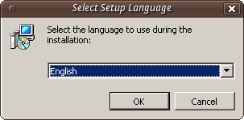

Cliquez sur "OK" et vous verrez cette fenêtre :

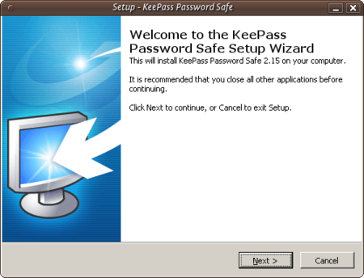

Appuyez juste sur "Suivant >" et poursuivez :

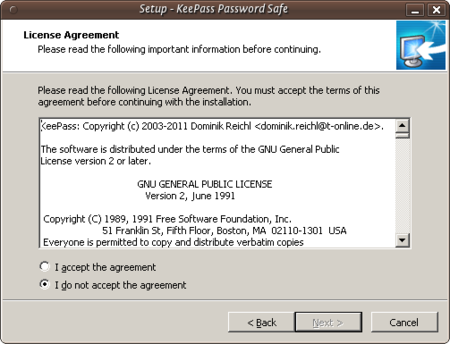

Dans la fenêtre ci-dessus, vous devez choisir "J'accepte" sinon vous ne pourrez pas installer le logiciel. Choisissez cette option et cliquez sur "Suivant >". Dans la fenêtre suivante, on vous demandera de choisir un emplacement pour l'installation. Vous pouvez laisser le choix par défaut à moins d'avoir une bonne raison de le changer.

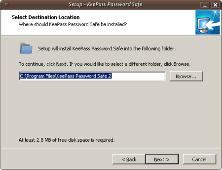

Cliquez sur "Suivant >" et continuez.

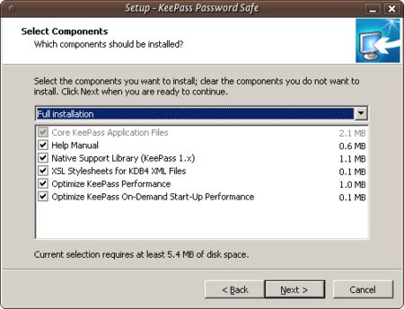

L'image ci-dessus montre les composants de KeePass que vous pouvez choisir. Laissez les options par défaut et cliquez sur "Suivant >". Vous arriverez sur une nouvelle fenêtre :

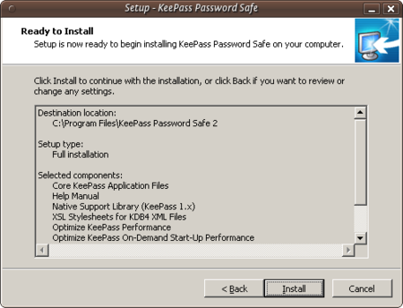

Ceci ne fait rien mais vous montre un résumé de vos options. Cliquez sur "Installer" et le processus d'installation devrait démarrer.

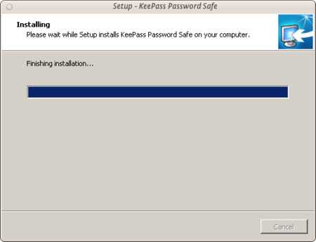

Installer KeePass sur Max OS X
------------------------------

Même si Keychain sur Mac OS X est un excellent gestionnaire de mots de passe, vous pourriez avoir besoin d'utiliser votre propre base de données de mots de passe. KeePass permet cet ajout de flexibilité. Premièrement, rendez-vous sur la page de téléchargement de KeePass [http://keepass.info/downloads.html](http://keepass.info/download.html) et choisissez l'installeur approprié. Même si les installeurs officiels sont listés en haut de la page, il y a des installeurs non officiels plus bas. Descendez donc pour trouver [KeePass 2.x pour Mac OS X][http://keepass2.openix.be/](http://keepass2.openix.be/):

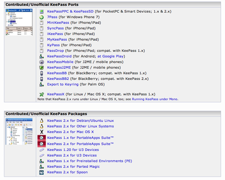

Comme c'est un lien externe, vous serez redirigé vers [http://keepass2.openix.be/](http://keepass2.openix.be/):

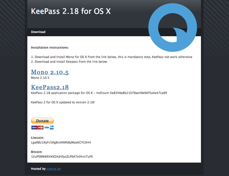

Notez que vous devez installer le framework Mono avant KeePass pour qu'il puisse fonctionner sur OS X. Donc, cliquez sur les liens [Mono 2.10.5](http://download.mono-project.com/archive/2.10.5/macos-10-x86/0/MonoFramework-MRE-2.10.5_0.macos10.xamarin.x86.dmg) et [KeePass2.18](http://keepass2.openix.be/KeePass2.18.dmg) pour télécharger les fichiers DMG. Double-cliquez sur les DMGs dans votre dossier de téléchargements pour ouvrir les volumes sur votre ordinateur.

Le nom de l'installeur Mono Package ressemble à "MonoFramework-MRE-2.10.5_0.macos10.xamarin.x86.pkg", double-cliquez donc sur ce document :

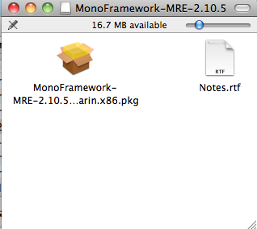

L'installeur va s'ouvrir et se lancer :

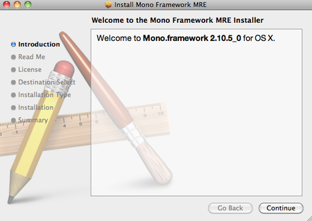

Suivez toutes les étapes en cliquant sur "Continuer", l'étape suivante étant "Lisez-moi". Dedans, il y a des informations importantes comme tous les fichiers qui seront installés mais aussi des informations sur la façon de désinstaller Mono :

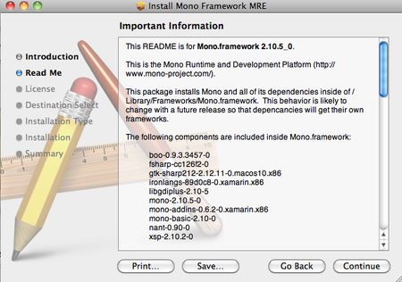

Cliquez sur "Continuer" pour atteindre la prochaine étape, la licence. Cliquez sur "Continuer" lorsque la licence apparaît. Si vous êtes d'accord avec les conditions de celle ci, l'installation continuera :

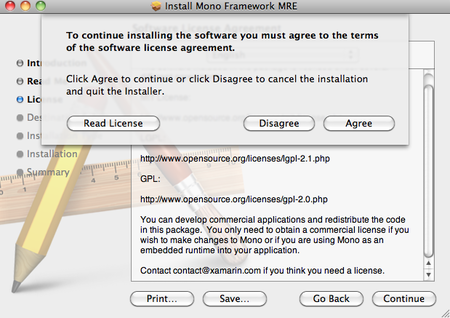

Les deux prochaines étapes de l'installation vous demanderons de choisir un emplacement de destination et vérifierons que vous avez assez d'espace disque. Quand l'installation sera terminée, vous verrez ceci sur l'écran :

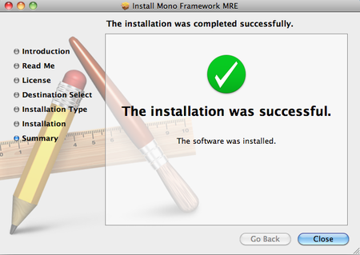

À présent, vous pouvez quitter l'installeur. Allez voir l'icône de KeePass, double-cliquez dessus pour l'ouvrir, et déplacez l'application KeePass dans le dossier Applications :

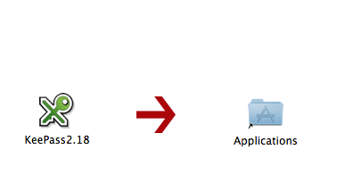

À présent, KeePass est prêt à être utilisé sur Mac OS X
