Chiffrer les mots de passe avec un gestionnaire de mots de passe
================================================================

Pour chiffrer les mots de passe, nous utilisons KeePass sur Windows, KeepassX sur Ubuntu et Keychain sur OS X. Le principe de base est toujours le même; vous avez un fichier sur votre ordinateur qui est chiffré avec *un seul mot de passe très sûr*. On le retrouve parfois sous le nom de "Master Password", "Admin-Password", "Root-Password", etc ... C'est la *clé ultime* qui protège tous les autres mots de passe. C'est pour cette raison que vous ne devez pas créer un mot de passe trop faible.

Si le gestionnaire de mots de passe fait partie de votre système d'exploitation (comme celui d'OS X), il s'ouvre automatiquement lors de l'ouverture de votre session et donc permet l'accès à des données sécurisés comme vos mots de passe. C'est pour cette raison, et bien d'autres, que vous devriez désactiver l'ouverture de session automatique. Lorsque vous démarrez votre ordinateur, vous devriez avoir besoin de taper un mot de passe. Encore mieux, configurez votre ordinateur afin qu'il ferme la session ou qu'il verrouille l'écran après un certain temps d'inactivité.

Chiffrer les mots de passe avec KeepassX sur Ubuntu
---------------------------------------------------

Commencez par ouvrir KeePassX.

La première fois que vous utilisez KeePassX, vous devez créer une nouvelle base de données pour enregistrer vos mots de passe. Cliquez sur Fichier -> Nouvelle base de données

Il vous demandera de créer un mot de passe maître.

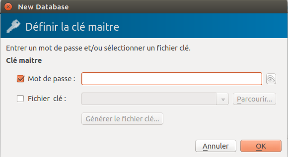

Choisissez un mot de passe fort - référez vous au chapitre sur les mots de passe si vous voulez quelques astuces sur la façon de le faire. Entrez le et appuyez sur "OK". Il vous demandera ensuite de retaper le mot de passe et d'appuyer sur "OK". Si les mots de passe correspondent, vous verrez la nouvelle "base de données" KeePassX prête à être utilisée.

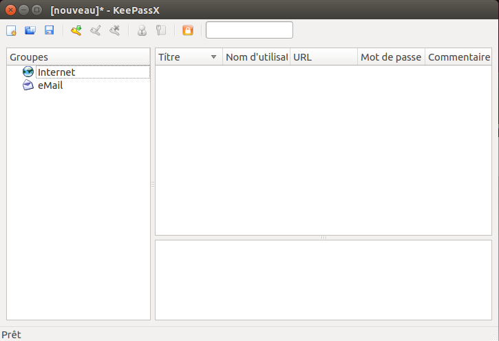

À présent, vous avez un endroit où stocker vos mots de passe en les protégeant par le mot de passe maître que vous venez d'inscrire. Vous verrez deux catégories par défaut, "Internet" et "Email", vous pouvez enregistrer toutes vos données dans ces deux catégories mais vous pouvez aussi créer ou supprimer des catégories, ajouter ou supprimer des groupes, etc... Pour l'instant, nous allons seulement utiliser les catégories par défaut et ajouter un mot de passe pour notre compte email.
Faîtes un clic droit sur la catégorie "Email" et choisissez "Ajouter une nouvelle entrée ..." :

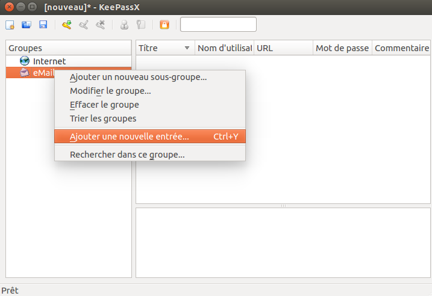

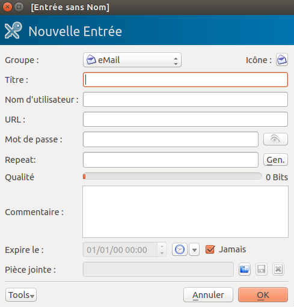

Remplissez les champs du formulaire avec des détails pour pouvoir aisément identifier avec quel compte email le mot de passe est associé. Vous devez complétez le champ "Titre" ainsi que les champs concernant le mot de passe. Tous les autres sont optionnels.

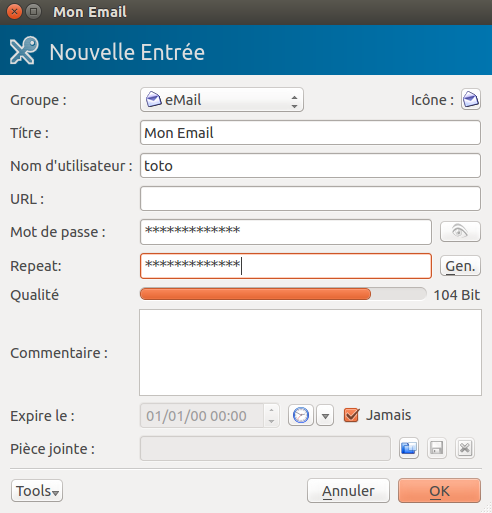

KeePassX nous donne une indication si le mot de passe est "fort" ou "faible". Même si ça semble évident, vous devriez essayer d'utiliser des mots de passe forts. Pour en savoir plus, rendez-vous au chapitre sur la création d'un bon mot de passe. Cliquez sur "OK" quand vous avez terminé et vous verrez quelque chose comme ça :

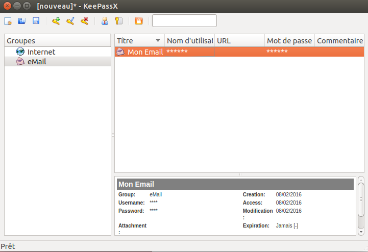

Pour retrouver les mots de passe (les voir), vous devez double-cliquer sur l'entrée et vous verrez la même fenêtre que vous avez utilisé lors de la création de cette entrée. Si vous cliquez sur l'icône représentant un oeil à droite du mot de passe, les étoiles (****) seront converties en texte pour que vous puissiez le lire.

Vous pouvez maintenant utiliser KeePassX pour stocker vos mots de passe. Toutefois, vous devez faire une dernière chose. Quand vous fermerez l'application (cliquez sur Fichier -> Quitter), elle vous demandera si vous voulez sauvegarder les changements effectués.

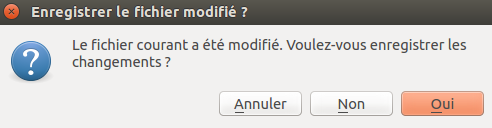

Appuyez sur le bouton "Oui". Si c'est la première fois que vous utilisez KeePassX (ou que vous venez de créer une nouvelle base de données), vous devez choisir un endroit où stocker le fichier de base de données. Sinon, les modifications seront enregistrées dans le fichier créé précédemment.

Lorsque vous voulez accèder aux mots de passe, vous devez ouvrir KeePassX et tapez le mot de passe maître. Après cela, vous pourrez ajouter des mots de passe dans la base de données mais aussi lire les entrées créées. Ce n'est pas une bonne idée de garder KeePassX ouvert de façon permanente car tout le monde pourrait voir vos mots de passe si ils peuvent accéder à votre ordinateur. Prenez l'habitude de l'ouvrir au moment où vous avez besoin d'un mot de passe et refermez-le juste après.

Chiffrer les mots de passe avec KeePass sur Windows
---------------------------------------------------

Après avoir installé KeePass sur Windows. Lancez l'application et la fenêtre suivante devrait apparaître.

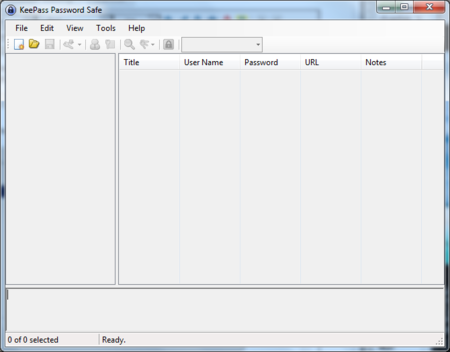

Il faut commencer par créer une base de données, le fichier qui contiendra vos mots de passe. Depuis le menu, cliquez sur "Fichier -> Nouvelle base de données". Vous devez choisir le nom et la localisation du fichier dans la fenêtre de dialogue ci-dessous. Dans cet exemple, nous avons appellé notre base de données "ma_base_de_mdp".

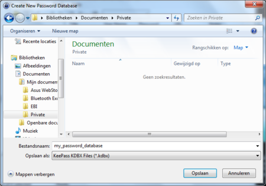

Dans la prochaine fenêtre, on vous demandera d'entrer un mot de passe maître. Entrez le mot de passe et cliquez sur "OK". Vous n'aurez rien d'autre à faire.

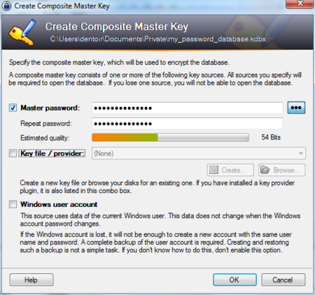

La fenêtre suivante vous permettra de configurer votre nouvelle base de données. Vous n'avez pas besoin d'éditer quoi que soit, cliquez simplement sur "OK".

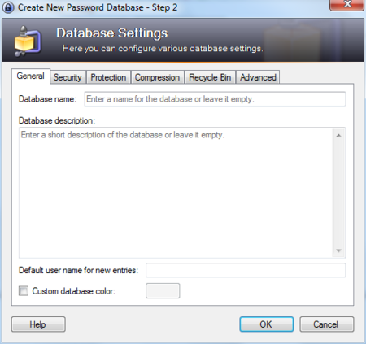

La fenêtre principale s'affiche alors et vous pouvez voir quelques catégories de mots de passe sur la colonne de gauche. Nous allons ajouter un nouveau mot de passe dans la catégorie "Internet". Cliquez d'abord sur le mot "Internet" et cliquez ensuite sur l'icône "Ajouter une nouvelle entrée ..." sur la barre de menu.

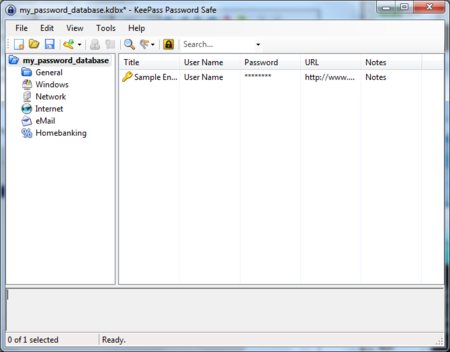

Une fenêtre apparaitra comme ci-dessous. Inscrivez une description pour ce mot de passe et, bien évidemment, entrez le mot de passe lui-même. Une fois terminé, cliquez sur "OK".

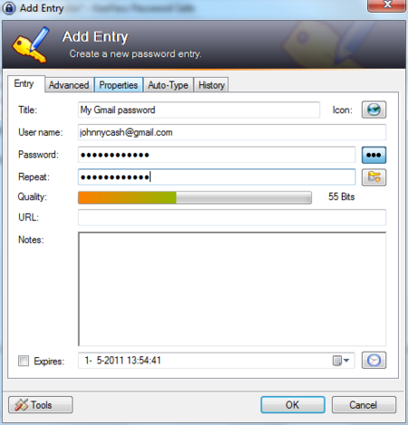

Chiffrer les mots de passe avec le Trousseau de clés sur OS X
-------------------------------------------------------------

Mac OS X fournit par défaut le gestionnaire de mot de passe "Keychain" ou, en français, "Trousseau de clés". En raison de son étroite intégration avec le système d'exploitation, vous aurez du mal à savoir qu'il existe. Mais de temps en temps, vous verrez une fenêtre s'afficher dans presque toutes les applications demandant "Voulez vous stocker le mot de passe dans votre trousseau de clés". Cela arrive lorsque vous ajoutez des nouveaux comptes dans votre client email, lorsque vous vous connectez sur un réseau Wifi protégé, lorsque vous entrez vos coordonnées dans votre client de messagerie instantannée, etc ...

Basiquement, Mac OS X vous offre la possibilité d'enregistrer toutes les données de connexion et les différents mots de passe dans un fichier chiffré qui est ouvert lorsque vous ouvrez une session sur votre ordinateur.
vous pouvez alors lire vos emails, vous connecter sur votre réseau Wifi et utiliser votre client de messagerie instantannée sans avoir besoin d'entrer vos identifiants.
C'est un processus complétement automatique mais, si vous voulez savoir ce qui est enregistré ou que vous voulez changer les mots de passe, vous pouvez simplement ouvrir l'application "Trousseau de clés".

Il est accessible dans le dossier "Utilitaires" qui est placé dans le dossier "Apllications".

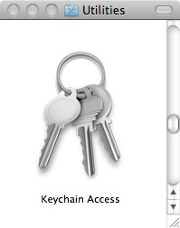

Lorsque vous l'ouvrirez, vous verrez que le trousseau est déverrouillé et vous pourrez voir toutes les entrées contenues dedans en bas à droite de la fenêtre.

(Note : la fenêtre ici est vide pour ne pas partager avec vous mon trousseau personnel)

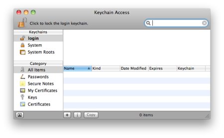

Vous pouvez double-cliquer sur chaque entrée dans le trousseau pour voir ses détails et cochez "Afficher le mot de passe : " pour voir le mot de passe associé à cet entrée.

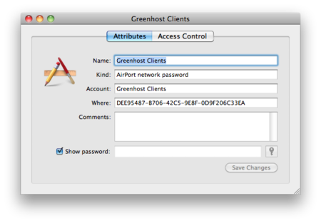

Vous noterez qu'on vous demandera votre mot de passe maître ou votre mot de passe de session pour voir l'entrée.

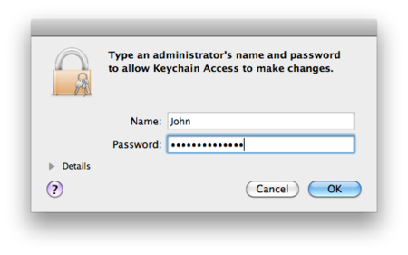

Vous pouvez accèder et modifier chaque entrée et aussi utiliser le trousseau pour protéger chaque bits et morceaux de texte en utilisant les notes. Pour faire cela, cliquez sur "Notes" et choisissez "Nouvelle note sécurisé" depuis le menu de fichier.
