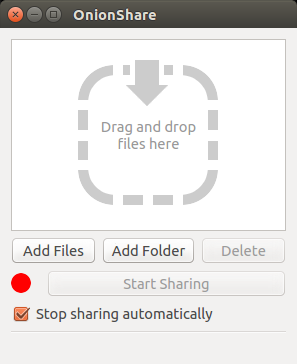
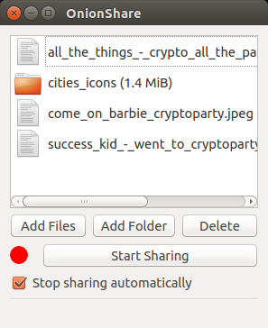
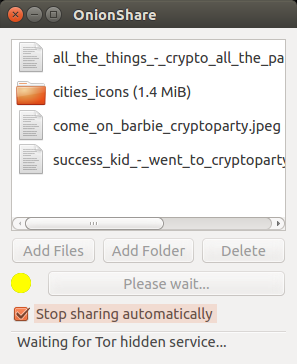
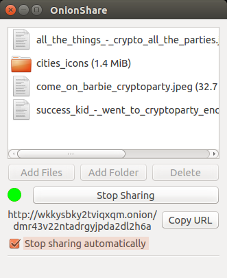
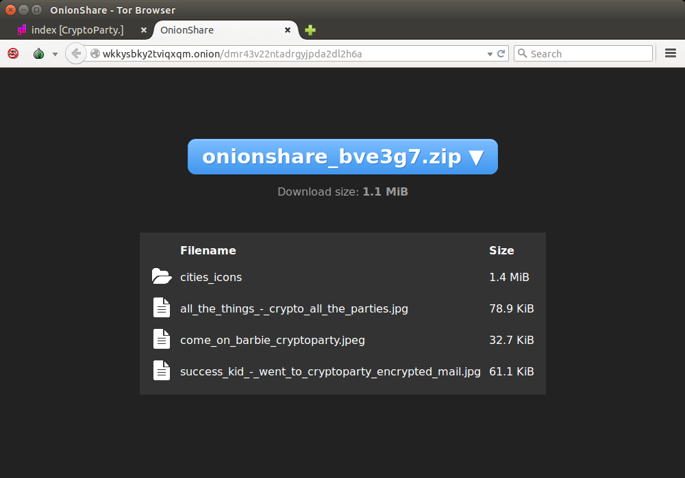
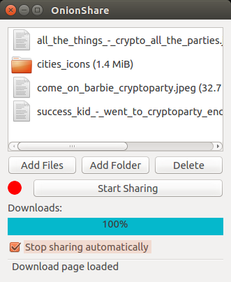

OnionShare
==========

Introduction
------------

Ceci est une traduction de la description du projet OnionShare disponible en version originale à cette adresse : [https://github.com/micahflee/onionshare/blob/master/README.md](https://github.com/micahflee/onionshare/blob/master/README.md)

> [OnionShare](https://onionshare.org/) vous permet de partager des fichiers de toutes tailles de façon sécurisé et anonyme. Il met en place un serveur web accessible via un service caché Tor et génère une URL unique pour accéder aux fichiers et les télécharger. Il n'y a pas besoin d'avoir un serveur sur Internet ou d'utiliser un service de partage de fichiers. Vous hébergez les fichiers sur votre ordinateur et utilisez un service caché Tor pour les rendre temporairement accessible sur Internet. Les utilisateurs n'ont qu'a utiliser le [Tor Browser](https://www.torproject.org/download/download-easy.html.en) pour télécharger vos fichiers.

Installation
------------

Les étapes d'installation sont fournies par le site web d'[OnionShare](https://onionshare.org/).

Utiliser OnionShare
-------------------

Voici à quoi ressemble [OnionShare](https://onionshare.org) lorsque vous le démarrer.

Vous pouvez partager autant de fichiers que vous voulez. Pour les ajouter, vous pouvez utiliser les boutons prévus à cet effet mais aussi déplacer simplement les fichiers dans la fenêtre.
Notez la case `Stop sharing automatically`. Celle ci permet de vous assurer que les fichiers ne pourront être téléchargés qu'une seule fois.

En cliquant sur le boutton `Start Sharing`, le petit serveur démarrera en tâche de fond. Les fichiers sont alors disponible pour vos amis mais seulement au travers du réseau  [Tor](https://torproject.org) car le serveur devient un [service caché](https://tor.eff.org/docs/hidden-services.html.en).
Démarrer ce type de service peut être long, donc, soyez patient.

Une fois le service caché déployé, copiez l'url en cliquant sur le bouton `Copy URL` et envoyez cette adresse à votre ami (par un canal chiffré si besoin).

Après avoir reçu le lien, votre ami peut l'ouvrir au sein du [Tor Browser](https://www.torproject.org/download/download-easy.html.en). Ça ne marchera pas avec les autres navigateurs.
Il verra alors un lien vers un fichier zip et la liste de fichiers contenus dedans. Un simple clic sur le gros bouton bleu démarrera le téléchargement.

Vous pouvez voir votre ami télécharger les fichiers au travers de la barre de progression bleue. Une fois que le téléchargement est terminé, [OnionShare](https://onionshare.org) arrête le partage automatique (à moins que la case `Stop sharing automatically` soit décochée).

Pour vérifier qu'[OnionShare](https://onionshare.org) ne partage plus vos fichiers, vous pouvez allez à l'adresse que vous avez envoyé à votre ami en utilisant votre [Tor Browser](https://www.torproject.org/download/download-easy.html.en). Le téléchargement n'est plus disponible.

